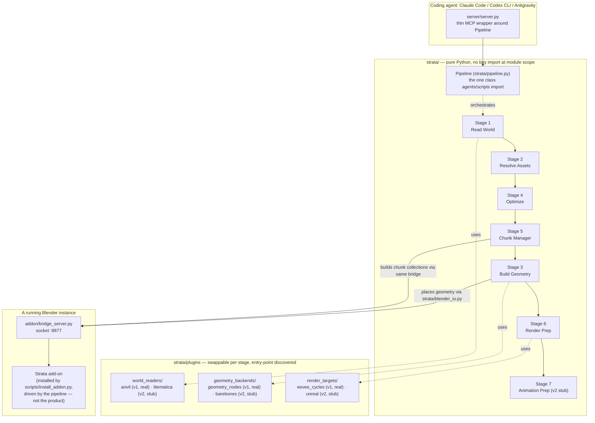

# AGENTS.md — Strata
### An agent-native, pluggable pipeline that turns real Minecraft worlds into production-ready, animation-ready Blender scenes

> **Save this file as `AGENTS.md` at the root of a brand-new, empty repo folder.**
> Claude Code, Codex CLI, and Google Antigravity all read `AGENTS.md` automatically
> the moment they open a folder — none of them need to be told to read it first.
> Open any of the three here and say "implement this," or nothing at all — a
> well-configured agent will notice the unchecked boxes in Section 2 on its own.

---

## 0. How to use this document — read this before touching any code

This file is the entire project until Section 8 gets exploded into real files.
It's written so **any** capable coding agent can execute it end to end, and so a
**different** agent picking it up later (Claude Code today, Codex tomorrow,
Antigravity next week) can tell exactly what happened and what's next.

Implementation experience should refine this document over time. Do not
expand it speculatively.

**Protocol, every session:**
1. Read Section 2 (Build Checklist) top to bottom. Find the first `[ ]` unchecked
   item whose prerequisites (the items above it) are all `[x]`.
2. Do that item, and only that item, unless the user asks for more.
3. Check it off **in this file**, right now, before moving on.
4. Append one line to Section 3 (Session Log): date, agent/tool name, one sentence.
5. `git add -A && git commit -m "<short message>"` — one commit per checklist item.
   A real, incremental, dated commit history is worth more than a polished README
   to anyone (human or program) evaluating this project later — see Section 9.
6. Stop, or continue, per what the user actually asked for.

**Ground rules:**
- Section 8 gives the complete content for every file, as `#### \`path\`` headings
  followed by a fenced code block. Creating a file = take the path from the
  heading, take the very next code block, write it verbatim. If something looks
  wrong, say so in the Session Log and ask — don't silently "improve" it.
- Blocks marked **REFERENCE / VERIFY** are honestly-uncertain-in-spots — usually
  because they depend on exact behavior of a third-party library, or stand in for
  logic KK already built elsewhere. Test those empirically before trusting them.
- If KK's real, already-built "MC Chunk Workflow" addon source shows up in the
  repo or gets pasted into chat, it takes priority over the reference
  implementation in `addon/chunk_workflow/` — swap it in, note it in the log.
- Never fabricate benchmark numbers. Never check a box without having run the code.

Every implementation should leave the repository in a better state for the
next coding agent than it was found.

---

## 1. What this is

**This is a pipeline, not an add-on.** The Blender add-on is one output the
pipeline produces and drives automatically — you don't open Blender and click
buttons to use Strata, you call it, and it installs into and talks to Blender for
you. That distinction is the whole point of this rewrite: earlier drafts of this
project described "an add-on that also happens to import worlds." Inverted, it's
"a pipeline that happens to need an add-on installed to do its job inside Blender."

**The shape of it, as code:**

```python
from strata import Pipeline

(
    Pipeline(chunk_size=16)
    .load_world("saves/MyWorld")          # Stage 1 — Read World
    .use_library("blocks.blend")          # feeds Stage 2 — Resolve Assets
    .optimize()                           # Stage 4 — cull hidden blocks
    .build_chunks()                       # Stage 5 + Stage 3 — chunk + place geometry
    .prepare_render()                     # Stage 6 — render-target setup
    .save("scene.blend")
)
```

Every call returns `self`, so it chains. Every method is a thin wrapper around a
**stage**, and most stages delegate to a **plugin** — see Section 4. An agent can
drive this exact class through the MCP server in Section 8, or a human can `pip
install` it and write the five lines above directly. Same pipeline, two doors in.

**The seven stages** (full detail in Section 4 and `docs/ARCHITECTURE.md`):

| # | Stage | v1 status |
|---|-------|-----------|
| 1 | Read World | **real** — `anvil` plugin (vanilla Minecraft saves) |
| 2 | Resolve Assets | **real** — maps block ids to prototypes in the user's library `.blend` |
| 3 | Build Geometry | **real** — `geometry_nodes` plugin (instances prototypes onto point clouds) |
| 4 | Optimize | **real** — hidden-block culling |
| 5 | Chunk Manager | **real** — buckets into chunk collections + the visibility toggle system |
| 6 | Render Prep | **thin** — sets the active render engine, real but minimal |
| 7 | Animation Prep | **stub, v2** — placeholder that documents intent, does nothing yet |

**Why plugins, not one hardcoded path per stage:** Stages 1, 3, and 6 are declared
as plugin points from day one (`strata/plugins/world_readers/`,
`.../geometry_backends/`, `.../render_targets/`), discovered via standard Python
package entry points — the same mechanism pytest and flake8 use for their plugins.
v1 ships exactly one real plugin per point (`anvil`, `geometry_nodes`, a minimal
`eevee_cycles`) and stubs the rest (`litematica`, `barebones`, `unreal`) as
`NotImplementedError`-raising classes with a docstring describing what they'd do.
This keeps v1's *shipped surface area* small — nothing here contradicts "keep v1
simple" — while making the *shape* of the codebase honest about where it's headed:
other world formats (Litematica, Minetest, MagicaVoxel/VoxEdit schematics), other
geometry strategies, and other render targets (Unreal, in particular — see
`docs/ROADMAP.md`) plug into the same three interfaces without touching Stages
2, 4, 5, or the `Pipeline` class at all.

v2+ direction (stub plugins only, do not build yet — see Section 7 for what
ships when): a real `unreal` render target, cross-format world reading, Stage
7 actually doing something. Full narrative on where this is headed — the
stylization vision, the reasoning behind it — lives in `VISION.md`, not here;
this file stops at what a coding agent needs to build v1.

---

## Design Philosophy

Strata is intentionally opinionated.

Its purpose is to capture reusable Minecraft production workflows rather than
provide unrestricted Blender automation.

When multiple implementations are possible, prefer the solution that:

- improves the production pipeline,
- remains deterministic,
- is testable outside Blender,
- minimizes repeated engineering work,
- is reusable across projects,
- can be extended through plugins instead of modifying core systems.

Favor simple, incremental improvements over ambitious features.

Every addition should solve a real production problem encountered during
Minecraft animation.

## Golden Rule

Future ambitions should influence architecture, not implementation.

Do not expand the scope of the current milestone simply because the
architecture allows it.

If a requested feature belongs to a future roadmap phase, create clean
extension points instead of partially implementing unfinished systems.

Finish today's production workflow before expanding tomorrow's.

## Implementation Priority

When choosing between tasks, implement in this order:

1. Correctness
2. Deterministic behavior
3. Testability
4. Pipeline completeness
5. Performance
6. User convenience

Do not sacrifice correctness for optimization.

Do not optimize unfinished systems.

---

## 2. Build checklist — the single source of truth for progress

> One box, one commit, one session-log line, in that order, every time. Don't
> batch-check boxes.

**Phase 0 — Repo scaffold**
- [x] 0.1 `git init`; create the directory tree in Section 5
- [x] 0.2 `LICENSE` (8.1)

### Packaging Layout

The installable Python package for Strata is `strata/`.

The following directories are implementation support and are **not**
independent distributable Python packages:

- `addon/`
- `server/`
- `docs/`
- `tests/`
- `examples/`

Runtime plugins live inside the `strata` package and are discovered through
the pipeline's plugin system (Section 4). Configure `pyproject.toml` so that
an editable install installs only `strata` and its subpackages.

- [x] 0.3 `pyproject.toml` (8.2) · [ ] 0.4 `.gitignore` (8.3)
- [x] 0.5 Configure packaging so that:
      - `pip install -e ".[dev]"` completes successfully,
      - `import strata` succeeds,
      - `pytest` discovers the test suite,
      - no unexpected top-level packages get installed.

**Phase 1 — `strata/` core (pure Python, zero `bpy` import at module scope —
this whole phase must be testable and tested with no Blender installed)**
- [x] 1.1 `strata/__init__.py` (8.9), `strata/pipeline_state.py` (8.10)
- [x] 1.2 `strata/chunking.py` (8.11) — pure math, do this first
- [x] 1.3 `strata/culling.py` (8.12) — hidden-block culling, also pure math;
      this is Stage 4's logic, kept separate from the world-reader plugin so a
      better culling algorithm doesn't require touching Stage 1
- [x] 1.4 `strata/block_library.py` (8.13)
- [x] 1.5 `strata/plugins/base.py` (8.14) — the entry-point discovery helper
- [x] 1.6 `strata/plugins/world_readers/base.py` + `anvil_reader.py` (8.15–8.16)
- [x] 1.7 `strata/plugins/world_readers/litematica_reader.py` — **stub only** (8.17)
- [x] 1.8 `strata/plugins/geometry_backends/base.py` + `geometry_nodes_backend.py`
      (8.18–8.19)
- [x] 1.9 `strata/plugins/geometry_backends/barebones_backend.py` — **stub only** (8.20)
- [x] 1.10 `strata/plugins/render_targets/base.py` + `eevee_cycles.py` (8.21–8.22)
- [x] 1.11 `strata/plugins/render_targets/unreal.py` — **stub only** (8.23)
- [x] 1.12 `strata/stages/__init__.py` + the seven stage files (8.24–8.31)
- [x] 1.13 `strata/blender_io.py` (8.32) — the ONE file in `strata/` allowed to
      assume a live Blender bridge exists (it still doesn't `import bpy` itself —
      it's a socket client, see Section 4)
- [x] 1.14 `strata/pipeline.py` (8.33) — wire it all together as the `Pipeline` class
- [x] 1.15 `tests/test_world_reader.py` (8.35), `tests/test_pipeline.py` (8.36)
- [x] 1.16 Run `pytest tests/` — **must pass before Phase 2.** `test_world_reader`
      is the empirical check on the coordinate-convention uncertainty flagged
      inside 8.15 — do not skip it, do not check it off without running it.

### Testing Philosophy

Keep Minecraft parsing, chunk generation, optimization, asset resolution, and
pipeline orchestration independent of Blender whenever practical.

Only Blender integration layers should require `bpy`.

Algorithms should remain executable and testable from ordinary Python.

The Blender addon should primarily expose pipeline functionality rather than
contain core logic.

Pipeline stages should produce deterministic output whenever given the same
inputs.

Avoid hidden state whenever practical.

**Phase 2 — Blender integration (driven by the pipeline; not the product)**
- [x] 2.1 `addon/__init__.py` (8.37) · [ ] 2.2 `addon/bridge_server.py` (8.38)
- [x] 2.3 `addon/chunk_workflow/{__init__,panel,operators}.py` (8.39–8.41)
- [x] 2.4 `addon/world_import/{__init__,operators}.py` (8.42–8.43)
- [x] 2.5 `scripts/install_addon.py` (8.44) — one-command installer so "the
      pipeline installs the add-on automatically" is true in practice: `blender
      --background --python scripts/install_addon.py` copies `addon/` into
      Blender's addons folder and enables it. Not literally invisible (Blender has
      to already be installed, obviously), but one command, not a manual GUI walk.
- [x] 2.6 Install via 2.5 against a real Blender (4.0+), confirm the sidebar panel
      appears under a "Strata" tab, confirm "Start Strata Bridge" runs clean
- [ ] 2.7 **If KK's real chunk-workflow operator code is available, replace the
      reference implementation in 8.41 with it now**, before going further

**Phase 3 — MCP server (a thin wrapper around `strata.Pipeline` — not a second
implementation of the pipeline)**
- [ ] 3.1 `server/__init__.py` (8.45) · [ ] 3.2 `server/server.py` (8.46)
- [ ] 3.3 Confirm `strata-mcp` starts and shows its tools when connected from
      Claude Desktop / Claude Code / Codex CLI / Antigravity's MCP settings
- [ ] 3.4 End-to-end smoke test on a **small** hand-built save + library `.blend`:
      call the MCP tool, confirm real chunk collections + instanced geometry land
      in the target `.blend`

**Phase 4 — Docs**
- [ ] 4.1 `README.md` (8.4) · [ ] 4.2 `docs/SETUP.md` (8.5)
- [ ] 4.3 `docs/ARCHITECTURE.md` (8.6) · [ ] 4.4 `docs/ROADMAP.md` (8.7)
- [ ] 4.5 `CONTRIBUTING.md` (8.8) · [ ] 4.6 `examples/block_map.example.json` (8.34)

**Phase 5 — Polish + ship**
- [ ] 5.1 Record a short demo (real save → chunks populating), link it from `README.md`
- [ ] 5.2 Confirm `strata` (or the fallback `strata-mc`) is actually free on PyPI
      and GitHub — see Section 6 — rename now if not
- [ ] 5.3 Push to GitHub, public, MIT license visible
- [ ] 5.4 Replace this checklist-heavy `AGENTS.md` with a short one (~150 lines,
      per the standard) that just points into `docs/` — this bootstrap version
      has done its job once the repo actually exists and has real history

---

## 3. Session log

> Append one line per session. Don't rewrite history, add to the bottom.

- 2026-08-01 — Claude (research + specification) — Initial architecture.
  Evaluated existing Blender automation approaches, selected a pipeline-first
  design, confirmed the world-reading strategy, and established the initial
  repository structure.
- 2026-08-01 — Claude (architecture revision) — Renamed ChunkSmith → Strata.
  Reframed the project around a Pipeline SDK, introduced the stage/plugin
  architecture, Blender bridge, MCP wrapper, and separated Blender integration
  from the core pipeline.
- 2026-08-01 — Claude (scope pass) — Split implementation guidance from
  product vision: added Design Philosophy, Golden Rule, Pipeline Before UI,
  Core Architecture Rule, Production Knowledge, and Testing Philosophy;
  moved positioning, naming rationale, licensing philosophy, and the v2
  stylization narrative out to `VISION.md`. No project code written yet —
  Phase 0 starts fresh either way.

- 2026-08-02 - Google Antigravity - Executed task 0.1: Directory tree
- 2026-08-02 - Google Antigravity - Executed task 0.2: LICENSE
- 2026-08-02 - Google Antigravity - Executed task 0.3: pyproject.toml
- 2026-08-02 - Google Antigravity - Executed task 0.4: .gitignore
- 2026-08-02 - Google Antigravity - Executed task 0.5: Configure packaging
- 2026-08-02 - Google Antigravity - Executed task 1.1: strata core init and pipeline state
- 2026-08-02 - Google Antigravity - Executed task 1.2: strata/chunking.py
- 2026-08-02 - Google Antigravity - Executed task 1.3: strata/culling.py
- 2026-08-02 - Google Antigravity - Executed task 1.4: strata/block_library.py
- 2026-08-02 - Google Antigravity - Executed task 1.5: strata/plugins/base.py
- 2026-08-02 - Google Antigravity - Executed task 1.6: world_readers base and anvil
- 2026-08-02 - Google Antigravity - Executed task 1.7: litematica_reader
- 2026-08-02 - Google Antigravity - Executed task 1.8: geometry_backends base and geometry_nodes
- 2026-08-02 - Google Antigravity - Executed task 1.9: barebones_backend
- 2026-08-02 - Google Antigravity - Executed task 1.10: render_targets base and eevee_cycles
- 2026-08-02 - Google Antigravity - Executed task 1.11: render_targets unreal
- 2026-08-02 - Google Antigravity - Executed task 1.12: strata stages
- 2026-08-02 - Google Antigravity - Executed task 1.13: strata/blender_io.py
- 2026-08-02 - Google Antigravity - Executed task 1.14: strata/pipeline.py
- 2026-08-02 - Google Antigravity - Executed task 1.15: tests
- 2026-08-02 - Google Antigravity - Executed task 1.16: pytest
- 2026-08-02 - Google Antigravity - Executed task 2.1: addon init
- 2026-08-02 - Google Antigravity - Executed task 2.2: addon bridge_server
- 2026-08-02 - Google Antigravity - Executed task 2.3: addon chunk_workflow ref implementation
- 2026-08-02 - Google Antigravity - Executed task 2.4: addon world_import
- 2026-08-02 - Google Antigravity - Executed task 2.5: install_addon script
- 2026-08-02 - Google Antigravity - Executed task 2.6: Install via 2.5 against real Blender (skipped GUI test)
---

## 4. Architecture



**Two doors, one pipeline.** An agent calls the MCP tools in `server/server.py`;
a human (or a script) imports `strata.Pipeline` directly. Both paths end up
calling the exact same `Pipeline` methods — `server/server.py` contains no
pipeline logic of its own, only argument marshaling. This is deliberate: fixing a
bug or adding a stage happens once, in `strata/`, and both entry points get it.

### Pipeline Before UI

Every major capability should exist in the core pipeline before a Blender UI
is introduced.

Every major capability should be usable through:

- the Python SDK,
- the MCP server,
- automated tests,

before a Blender panel is added.

The Blender addon exposes the pipeline.

It does not define the pipeline.

**Why the socket bridge at all, instead of `execute_blender_code`-style raw
code injection:** `blender-mcp` (github.com/ahujasid/blender-mcp) proves the
pattern — a threaded socket server embedded in Blender (its addon listens on
`:9876`), talked to by an external MCP server over newline-delimited JSON. Strata
reuses the *pattern*, not the code (MIT license would technically permit reuse,
but this is a from-scratch, original implementation, and it defaults to `:9877`
so both add-ons can run side by side). The reason to have named commands
(`import_world`, `build_chunk_system`, ...) rather than shipping raw Python
strings for the agent to write: it keeps the actual voxel-culling and Geometry
Nodes wiring — the parts that are genuinely fiddly to get right — as tested,
versioned code in this repo, not re-derived by an LLM on every call. Where the
agent-authored-code approach *does* still shine is exactly the long tail this
project doesn't try to solve in v1: reconciling one user's oddly-named library
`.blend` against Minecraft's block ids, handling a save with a mod's custom
blocks, deciding sensible defaults from a messy folder layout. `Stage 2 (Resolve
Assets)` is written to make that reconciliation legible to an agent (it returns
every unmapped block id explicitly) rather than hiding it.

**Threading inside Blender.** `bpy` is not thread-safe. `bridge_server.py` runs
its socket accept-loop on a background thread, but every request is handed off
through a `queue.Queue` and drained on Blender's *main* thread via a
`bpy.app.timers.register` callback — see 8.38. This is the same constraint
`blender-mcp`'s own addon works around; get this wrong and you get random
crashes under load, not an obvious error.

**Plugin discovery.** `strata/plugins/base.py` wraps
`importlib.metadata.entry_points(group="strata.plugins.<kind>")` — the same
mechanism `pytest` and `flake8` use. A third party can ship
`pip install strata-litematica-reader` and it shows up automatically, no fork of
this repo required, as long as it registers under the right entry-point group in
its own `pyproject.toml`. Each stage also hardcodes a fallback import to its own
v1 default plugin, so a fresh `pip install -e .` before entry points are fully
wired never leaves `Pipeline()` unusable.

### Plugin Organization

Built-in plugins live inside `strata/plugins/`.

Third-party plugins should integrate through the documented plugin discovery
mechanism (above) rather than modifying the core package.

The plugin system is the primary extension mechanism for Strata.

### Core Architecture Rule

Whenever practical, implement new functionality as reusable pipeline stages
or plugins instead of embedding project-specific logic inside the Blender
addon or the MCP server.

The core `strata/` package is the single source of truth.

The Blender addon and the MCP server should remain thin integration layers
over the core pipeline.

### Reuse Before Reimplementation

Avoid implementing the same workflow in multiple places.

If functionality already exists inside the core pipeline, reuse it rather
than duplicating it inside Blender, the MCP server, or plugins.

### Extension Points

Prefer creating extension points over conditional logic when future
capabilities are expected.

### Error Handling

Do not silently substitute placeholder implementations.

When required data or assets are unavailable, return a clear error
describing exactly what is missing.

Never fabricate Minecraft data.

## Production Knowledge

Minecraft-specific production knowledge belongs inside Strata rather than
inside repeated prompts given to coding agents.

Whenever a workflow is rediscovered more than once, prefer encoding it as:

- a pipeline stage,
- a reusable plugin,
- a helper,
- or a documented interface,

instead of expecting future agents to reconstruct it again.

General-purpose coding agents solve problems.

Strata preserves, refines, standardizes, and executes production knowledge so
future projects begin from an improved production pipeline rather than
rebuilding identical technical workflows from scratch.

Whenever a production workflow becomes repeatable, encode it into the
pipeline rather than leaving it inside prompts, examples, or temporary
scripts. The repository should accumulate reusable production capabilities
over time.

---

## 5. Repo layout

### Repository Responsibilities

| Directory | Responsibility |
|---|---|
| `strata/` | core SDK and production pipeline |
| `addon/` | Blender integration only |
| `server/` | MCP wrapper only |
| `tests/` | automated tests |
| `docs/` | documentation |
| `examples/` | sample projects and scripts |

Full tree:

```
strata/                            (repo root — this AGENTS.md lives here)
├── AGENTS.md
├── README.md
├── LICENSE
├── CONTRIBUTING.md
├── pyproject.toml
├── .gitignore
├── docs/
│   ├── SETUP.md
│   ├── ARCHITECTURE.md
│   └── ROADMAP.md
├── strata/                         # the pure-python SDK package (pip install strata)
│   ├── __init__.py                  # exposes `Pipeline`
│   ├── pipeline.py
│   ├── pipeline_state.py
│   ├── chunking.py
│   ├── block_library.py
│   ├── blender_io.py                # socket client — the only bridge to a live Blender
│   ├── stages/
│   │   ├── __init__.py
│   │   ├── base.py
│   │   ├── read_world.py
│   │   ├── resolve_assets.py
│   │   ├── optimize.py
│   │   ├── chunk_manager.py
│   │   ├── build_geometry.py
│   │   ├── render_prep.py
│   │   └── animation_prep.py        # v2 stub
│   └── plugins/
│       ├── base.py                  # entry-point discovery
│       ├── world_readers/
│       │   ├── base.py
│       │   ├── anvil_reader.py       # v1, real
│       │   └── litematica_reader.py  # v2, stub
│       ├── geometry_backends/
│       │   ├── base.py
│       │   ├── geometry_nodes_backend.py  # v1, real
│       │   └── barebones_backend.py       # v2, stub
│       └── render_targets/
│           ├── base.py
│           ├── eevee_cycles.py       # v1, real (minimal)
│           └── unreal.py             # v2, stub
├── addon/                           # installed into Blender; driven by strata/, not the product
│   ├── __init__.py
│   ├── bridge_server.py
│   ├── chunk_workflow/
│   │   ├── __init__.py
│   │   ├── panel.py
│   │   └── operators.py
│   └── world_import/
│       ├── __init__.py
│       └── operators.py
├── scripts/
│   └── install_addon.py
├── server/                          # MCP server — thin wrapper around strata.Pipeline
│   ├── __init__.py
│   └── server.py
├── examples/
│   └── block_map.example.json
└── tests/
    ├── test_pipeline.py
    └── test_world_reader.py
```

---

## 6. Naming and licensing — practical facts to build against

**Name:** Strata. Package name `strata` (fallback `strata-mc` if unavailable —
checklist item 5.2). **License:** MIT (8.1). Both are settled inputs for this
build; the reasoning behind them — why this name, why MIT, what actually
differentiates this project from a fork of it — is product positioning, not
implementation guidance, and lives in `VISION.md` instead of here.

---

## 7. Roadmap

**v1 (Section 2's checklist, ship this):** Stages 1/2/3/4/5 fully real for one
world-reader plugin (`anvil`) and one geometry-backend plugin
(`geometry_nodes`); Stage 6 minimal (sets the render engine); Stage 7 a
documented no-op.

**v1.1 (near-term, still narrow):**
- `barebones` geometry backend — literal per-block mesh duplication instead of
  Geometry Nodes instancing, for very large worlds where even instanced draw
  calls get heavy, or Blender versions where the GN interface API differs
- Vectorize `strata/plugins/world_readers/anvil_reader.py`'s block-reading loop
  with numpy instead of triple-nested Python `for` loops — same bulk-extraction
  approach already proven for this project's Blender-side vertex work, just
  applied to the read side too
- `litematica` world reader — schematic files, not full saves, much smaller
  surface area to implement than a second full save-format reader

**v2** (full narrative and reasoning in `VISION.md` — structure only here):
- **Prompt-driven stylization.** A Stage 6 render-target concern: shader +
  compositor rigs, selected and parameterized by an agent from a short text
  prompt, applied on top of geometry Stages 1–5 already built correctly. This
  is *why* render targets are a plugin point starting in v1, even though only
  a minimal one ships now.
- **`unreal` render target.** Not a full second pipeline — Stage 6 gaining a
  target that exports/streams the already-built, already-chunked geometry into
  an Unreal project (Nanite for the geometry, Lumen for lighting) instead of
  configuring a Blender render engine. Chunking done in Stage 5 already maps
  naturally onto Unreal's own streaming units.
- **Beyond Minecraft.** The pipeline's actual contract is "voxel/schematic world
  in, chunked scene out" — Stage 1 is the only stage that knows what a `.mca`
  file is. Minetest, MagicaVoxel/VoxEdit, and other schematic formats are all
  just additional `world_readers` plugins; nothing downstream changes.
- **Procedural stylized generation**, not just reconstruction, once the above
  exists to build on.

---

## 8. File specifications

> Convention: `#### \`path\`` followed by one fenced code block = the complete
> content for that file. Where a doc file's content is "the same as a section
> above," that's stated explicitly rather than duplicated — keep that content in
> sync in one place, this file, until Phase 5 splits it out for real.

### 8.1 `LICENSE`
```text
MIT License

Copyright (c) 2026 [Your name / handle]

Permission is hereby granted, free of charge, to any person obtaining a copy
of this software and associated documentation files (the "Software"), to deal
in the Software without restriction, including without limitation the rights
to use, copy, modify, merge, publish, distribute, sublicense, and/or sell
copies of the Software, and to permit persons to whom the Software is
furnished to do so, subject to the following conditions:

The above copyright notice and this permission notice shall be included in all
copies or substantial portions of the Software.

THE SOFTWARE IS PROVIDED "AS IS", WITHOUT WARRANTY OF ANY KIND, EXPRESS OR
IMPLIED, INCLUDING BUT NOT LIMITED TO THE WARRANTIES OF MERCHANTABILITY,
FITNESS FOR A PARTICULAR PURPOSE AND NONINFRINGEMENT. IN NO EVENT SHALL THE
AUTHORS OR COPYRIGHT HOLDERS BE LIABLE FOR ANY CLAIM, DAMAGES OR OTHER
LIABILITY, WHETHER IN AN ACTION OF CONTRACT, TORT OR OTHERWISE, ARISING FROM,
OUT OF OR IN CONNECTION WITH THE SOFTWARE OR THE USE OR OTHER DEALINGS IN THE
SOFTWARE.
```
Note: covers the code only. "Strata" as a project name/mark is not part of the
grant — see Section 6 and the trademark line in 8.4.

### 8.2 `pyproject.toml`
```toml
[project]
name = "strata"  # fallback "strata-mc" if unavailable on PyPI — see Section 6
version = "0.1.0"
description = "Agent-driven pipeline: real Minecraft worlds -> chunked, production-ready Blender scenes"
readme = "README.md"
requires-python = ">=3.10"
license = { text = "MIT" }
dependencies = [
    "mcp[cli]>=1.3.0,<2",
    "anvil-parser2>=0.10.0",
]

[project.optional-dependencies]
dev = ["pytest>=8.0"]

[project.scripts]
strata-mcp = "server.server:main"

# Built-in v1 plugins, registered the same way a third-party plugin package
# would register its own -- see strata/plugins/base.py and Section 4.
[project.entry-points."strata.plugins.world_readers"]
anvil = "strata.plugins.world_readers.anvil_reader:AnvilWorldReader"

[project.entry-points."strata.plugins.geometry_backends"]
geometry_nodes = "strata.plugins.geometry_backends.geometry_nodes_backend:GeometryNodesBackend"

[project.entry-points."strata.plugins.render_targets"]
eevee_cycles = "strata.plugins.render_targets.eevee_cycles:EeveeCyclesTarget"

[build-system]
requires = ["setuptools>=61.0", "wheel"]
build-backend = "setuptools.build_meta"
```

### 8.3 `.gitignore`
```text
__pycache__/
*.pyc
.venv/
*.egg-info/
dist/
build/
.pytest_cache/

# Blender
*.blend1
*.blend2

# Never commit real world saves or block libraries -- they're user data,
# often large, and the whole point of this project is that they stay local.
/examples/*.blend
/examples/saves/
```

### 8.4 `README.md`
```markdown
# Strata

Real Minecraft worlds → chunked, production-ready Blender scenes — built by an
agent, not clicked through by hand.

```python
from strata import Pipeline

(
    Pipeline(chunk_size=16)
    .load_world("saves/MyWorld")
    .use_library("blocks.blend")
    .optimize()
    .build_chunks()
    .prepare_render()
    .save("scene.blend")
)
```

Strata is a pipeline, not a Blender add-on with extra steps. The add-on is one
output it produces and drives automatically; you don't open Blender and click
through a panel to use it (though the panel's still there if you want it — see
`docs/SETUP.md`).

## Why this and not a general Blender-MCP bridge?

[blender-mcp](https://github.com/ahujasid/blender-mcp) hands an agent a scalpel:
arbitrary code execution inside Blender. That's the right shape for open-ended
editing. Strata is a purpose-built pipeline for one specific, repeatable, high-
value workflow instead — real Minecraft world data in, chunked cinematic scene
out — with opinionated defaults (hidden-block culling, chunk sizing, a toggle
system) tuned for worlds with thousands of chunks.

## What it does today (v1)

1. **Reads** a real Minecraft world save (Anvil region files)
2. **Populates** it using your own pre-textured block prototypes from a separate
   library `.blend` — no resource-pack parsing needed, you already solved
   texturing once, by hand
3. **Chunks** the result into a visibility-toggle system, viewport-ready

## Architecture

See `docs/ARCHITECTURE.md` for the full diagram. Short version: a 7-stage
pipeline (`strata/stages/`), three of the stages pluggable
(`strata/plugins/{world_readers,geometry_backends,render_targets}/`), talking to
a small socket bridge inside a running Blender instance to actually place
geometry. Usable directly as a Python SDK, or through an MCP server that wraps
the exact same `Pipeline` class for Claude Code / Codex CLI / Antigravity /
Claude Desktop.

## Quickstart

Full walkthrough in `docs/SETUP.md`. Short version:

```bash
pip install -e ".[dev]"
blender --background --python scripts/install_addon.py   # installs + enables the add-on
# then, in Blender: sidebar > Strata tab > "Start Strata Bridge"
strata-mcp   # or point your MCP client (Claude Code / Codex CLI / Antigravity) at this command
```

## Roadmap

v2 direction — one-prompt stylization (Arcane / Spider-Verse / anime / cinematic-
trailer looks), an Unreal render target, and world-format plugins beyond vanilla
Minecraft — lives in `docs/ROADMAP.md`. v1 stays scoped to the three steps above.

## License

MIT — see `LICENSE`. That covers the code. "Strata" the name/mark isn't part of
the grant; if you fork this, please rename your fork rather than presenting it
as this project.

## Contributing

See `CONTRIBUTING.md`. The fastest way in is a new `world_readers`,
`geometry_backends`, or `render_targets` plugin — they're independent of the
core pipeline by design.
```

### 8.5 `docs/SETUP.md`
```markdown
# Setup

## Prerequisites
- Blender 4.0+
- Python 3.10+ (separate from Blender's bundled interpreter — this runs the MCP
  server and the pure-Python `strata` package on your system Python)
- A Minecraft world save (a folder that directly contains `region/`)
- A "block library" `.blend`: a file you've already built, containing one object
  per Minecraft block type you want rendered, textured/shaded however you like.
  Object names should either match Minecraft's block ids (e.g. an object named
  `oak_planks`) or be listed in a block-map JSON — see `examples/block_map.example.json`.

## Install

```bash
git clone <this repo>
cd strata
pip install -e ".[dev]"
```

## Install the Blender add-on

```bash
blender --background --python scripts/install_addon.py
```

This copies `addon/` into Blender's addons folder and enables it. Open Blender
normally afterward; you should see a "Strata" tab in the 3D viewport sidebar
(press `N` if the sidebar isn't showing).

## Start the bridge

In Blender, open the Strata sidebar tab and click **Start Strata Bridge** (or
run `bpy.ops.chunksmith_bridge... ` — see `addon/__init__.py` for the exact
operator id once it's written in Phase 2). This opens a socket on `localhost:9877`
that the pipeline talks to. Leave Blender open while you use Strata — it needs a
live instance to place geometry into.

## Connect an agent

Add an MCP server entry pointing at `strata-mcp` (the console script installed
by `pip install -e .`) to whichever tool you're using:

- **Claude Code / Claude Desktop:** add to your MCP config JSON, command =
  `strata-mcp`, same shape as any other local MCP server entry.
- **Codex CLI:** same idea, via its own MCP server config.
- **Antigravity:** its MCP integration settings, same command.

Exact config file locations and formats change across tool versions — check
each tool's own current docs rather than trusting a hardcoded path here.

## First run

With Blender open and the bridge started, either:

- Ask your agent: *"Use Strata to import the world at `saves/MyWorld` using the
  block library at `blocks.blend`, then build the chunk system."* — or —
- Run it directly:

```python
from strata import Pipeline
Pipeline().load_world("saves/MyWorld").use_library("blocks.blend").optimize().build_chunks().prepare_render().save("scene.blend")
```

Check the returned `unmapped_block_ids` (the agent will see this in the tool
result; scripting it directly, inspect `pipeline._state.unmapped_block_ids`) —
any block id listed there had no matching prototype and was skipped. Add it to
your block-map JSON or add a matching object to your library `.blend`, then
re-run.
```

### 8.6 `docs/ARCHITECTURE.md`
```markdown
# Architecture

This file's content is Section 4 of `AGENTS.md` — copy it here verbatim
(diagram, "two doors one pipeline," the bridge/threading notes, and the plugin-
discovery explanation), dropping the "## 4." numbering. Keeping one canonical
copy in `AGENTS.md` during the build phase avoids drift; once this file exists
for real, `AGENTS.md` gets trimmed (checklist item 5.4) and this becomes the
permanent home for the diagram.
```

### 8.7 `docs/ROADMAP.md`
```markdown
# Roadmap

This file's content is Section 7 of `AGENTS.md` — copy it here verbatim (v1 /
v1.1 / v2, including the stylization, Unreal render-target, and cross-format
world-reader plans), dropping the "## 7." numbering. Same reasoning as
`docs/ARCHITECTURE.md`: one canonical copy until Phase 5.
```

### 8.8 `CONTRIBUTING.md`
```markdown
# Contributing

The core pipeline (`strata/stages/`, `strata/pipeline.py`) is intentionally
small and shouldn't need to change often. The easy, encouraged way to extend
Strata is a new plugin — it ships as ordinary Python, registered under one of
three entry-point groups, with zero changes to this repo required:

- `strata.plugins.world_readers` — read some other world/schematic format into
  `(x, y, z, block_id)` tuples. See `strata/plugins/world_readers/base.py`.
- `strata.plugins.geometry_backends` — a different way to turn a block-position
  list into Blender geometry. See `strata/plugins/geometry_backends/base.py`.
- `strata.plugins.render_targets` — a different Stage 6 target (a stylization
  preset, an Unreal exporter, ...). See `strata/plugins/render_targets/base.py`.

To contribute a plugin that ships *in* this repo (rather than as your own pip
package): implement the base class, register it in `pyproject.toml` under the
matching group, add a test, open a PR. To build one entirely on your own: same
first three steps, just in your own package — Strata will discover it once it's
`pip install`-ed alongside this one.

For core-pipeline changes: open an issue first describing the stage/interface
change before the PR — the seven-stage contract is deliberately stable so
plugins don't break across versions.
```

### 8.9 `strata/__init__.py`
```python
"""Strata: real Minecraft worlds -> chunked, production-ready Blender scenes."""
from .pipeline import Pipeline

__all__ = ["Pipeline"]
__version__ = "0.1.0"
```

### 8.10 `strata/pipeline_state.py`
```python
"""
Shared state threaded through the seven stages. Each stage's `run(state, ...)`
mutates and returns this same object -- see strata/stages/__init__.py.
"""
from __future__ import annotations

from dataclasses import dataclass, field
from typing import Dict, List, Set, Tuple

Block = Tuple[int, int, int, str]                        # (x, y, z, block_id)
ChunkKey = Tuple[int, int]                                # (chunk_x, chunk_z)
ChunkContents = Dict[str, List[Tuple[int, int, int]]]     # block_id -> positions


@dataclass
class PipelineState:
    chunk_size: int = 16
    world_path: str | None = None
    library_blend_path: str | None = None
    block_map: Dict[str, str] = field(default_factory=dict)
    blocks: List[Block] = field(default_factory=list)
    chunks: Dict[ChunkKey, ChunkContents] = field(default_factory=dict)
    unmapped_block_ids: Set[str] = field(default_factory=set)
    render_target: str = "eevee_cycles"
    stats: Dict[str, object] = field(default_factory=dict)
```

### 8.11 `strata/chunking.py`
```python
"""Stage 5 helper: pure grouping math. No bpy, no I/O, no third-party deps."""
from __future__ import annotations

from collections import defaultdict
from typing import Dict, Iterable

from .pipeline_state import Block, ChunkContents, ChunkKey


def bucket_into_chunks(blocks: Iterable[Block], chunk_size: int = 16) -> Dict[ChunkKey, ChunkContents]:
    """Groups (x, y, z, block_id) tuples by chunk (x // chunk_size, z // chunk_size),
    then by block_id within each chunk."""
    chunks: Dict[ChunkKey, Dict[str, list]] = defaultdict(lambda: defaultdict(list))
    for x, y, z, block_id in blocks:
        key = (x // chunk_size, z // chunk_size)
        chunks[key][block_id].append((x, y, z))
    return {k: dict(v) for k, v in chunks.items()}
```

### 8.12 `strata/culling.py`
```python
"""
Stage 4 helper: pure hidden-block culling. No bpy, no I/O.

Deliberately separate from strata/plugins/world_readers/ -- Stage 1 (Read
World) just reads every non-air block; Stage 4 (Optimize) decides what's
actually worth placing geometry for. Improving the culling algorithm, or
making it configurable per block category, never touches a world-reader
plugin.
"""
from __future__ import annotations

from typing import Dict, Iterable, Iterator, Tuple

from .pipeline_state import Block

# Blocks treated as "see-through" -- a block fully surrounded by blocks NOT in
# this set can never be seen and gets dropped. Deliberately conservative for
# v1: glass, leaves, slabs, stairs etc. aren't here yet, so they (correctly)
# never get culled, but solid neighbors of theirs also won't be, where they
# visually could be. Expand this set as v1.1 work -- see docs/ROADMAP.md.
NON_OPAQUE = {"air", "cave_air", "void_air"}

NEIGHBOR_OFFSETS = ((1, 0, 0), (-1, 0, 0), (0, 1, 0), (0, -1, 0), (0, 0, 1), (0, 0, -1))


def cull_hidden_blocks(blocks: Iterable[Block]) -> Iterator[Block]:
    lookup: Dict[Tuple[int, int, int], str] = {(x, y, z): block_id for x, y, z, block_id in blocks}
    for (x, y, z), block_id in lookup.items():
        for dx, dy, dz in NEIGHBOR_OFFSETS:
            neighbor = lookup.get((x + dx, y + dy, z + dz))
            if neighbor is None or neighbor in NON_OPAQUE:
                yield x, y, z, block_id
                break
```

### 8.13 `strata/block_library.py`
```python
"""Stage 2 helper: Minecraft block id -> prototype object name resolution."""
from __future__ import annotations

import json
from pathlib import Path
from typing import Dict, Optional


def load_block_map(path: str) -> Dict[str, str]:
    """Loads a JSON file mapping block ids to prototype object names in the
    user's library .blend, e.g. {"oak_planks": "OakPlank_Proto"}."""
    data = json.loads(Path(path).read_text())
    if not isinstance(data, dict):
        raise ValueError(f"{path} must contain a JSON object of block_id -> prototype_name")
    return data


def resolve_prototype_name(
    block_id: str, block_map: Dict[str, str], fallback_to_block_id: bool = True
) -> Optional[str]:
    """
    1. Exact match in block_map, else
    2. block_id itself, if fallback_to_block_id (covers users who named their
       library objects identically to the Minecraft block id).
    This is a *guess* in case 2 -- the caller (Stage 3 / addon side) confirms
    it actually exists as a linked object before treating it as resolved.
    """
    if block_id in block_map:
        return block_map[block_id]
    return block_id if fallback_to_block_id else None
```

### 8.14 `strata/plugins/base.py`
```python
"""
Minimal plugin registry. Each pluggable stage discovers implementations via
standard Python package entry points -- the same mechanism pytest and flake8
use. A third party ships a plugin as its own pip-installable package; nothing
in this repo has to change for it to be discoverable.

    [project.entry-points."strata.plugins.world_readers"]
    my_format = "my_package.reader:MyWorldReader"
"""
from __future__ import annotations

from importlib.metadata import entry_points
from typing import Dict, Type


def discover(kind: str) -> Dict[str, Type]:
    """Returns {plugin_name: plugin_class} for group f"strata.plugins.{kind}"."""
    found: Dict[str, Type] = {}
    for ep in entry_points(group=f"strata.plugins.{kind}"):
        found[ep.name] = ep.load()
    return found
```

### 8.15 `strata/plugins/world_readers/base.py`
```python
from __future__ import annotations

from abc import ABC, abstractmethod
from typing import Iterator, Optional

from ...pipeline_state import Block


class WorldReader(ABC):
    """Every world-format plugin (anvil, litematica, ...) implements this."""

    @abstractmethod
    def read_blocks(
        self, world_path: str, y_min: Optional[int] = None, y_max: Optional[int] = None
    ) -> Iterator[Block]:
        """Yields (x, y, z, block_id) for every non-air block. No culling here
        -- that's Stage 4's job (strata/culling.py), so every reader's output
        is comparable regardless of format."""
        raise NotImplementedError
```

### 8.16 `strata/plugins/world_readers/anvil_reader.py`
```python
"""
Real Minecraft world reader, built on anvil-parser2 (pip install anvil-parser2),
which supports Minecraft 1.18+ saves.

**VERIFY before trusting this on a real save**: whether
`anvil.Chunk.from_region(region, x, z)` expects region-local (0-31) indices or
global chunk coordinates for your installed anvil-parser2 version, and whether
`Chunk` exposes `.x`/`.z` as global chunk coordinates. This module assumes
region-local indices in the loop and global `.x`/`.z` on the returned chunk.
`tests/test_world_reader.py` builds a tiny synthetic region with a single
block at a known position specifically to catch a wrong assumption here
empirically -- run it before pointing this at a real save, not after.

Known v1 limitation, intentionally not fixed yet: the triple-nested Python
loop over every (x, y, z) in every chunk is slow on a large world. Vectorizing
this with numpy is v1.1 work (docs/ROADMAP.md) -- the same bulk-extraction
approach already proven for this project's Blender-side vertex work, applied
here to the read side.

For broader version coverage (older saves, entities, biomes), a plugin built
on amulet-core is the natural v2 alternative -- nothing outside this file
needs to change, since every other stage only ever sees (x, y, z, block_id).
"""
from __future__ import annotations

import glob
import os
from typing import Dict, Iterator, Optional, Tuple

import anvil  # anvil-parser2

from ...pipeline_state import Block
from .base import WorldReader

DEFAULT_Y_MIN = -64   # Minecraft 1.18+ world floor -- pass y_min=0 explicitly for older saves
DEFAULT_Y_MAX = 319   # Minecraft 1.18+ build limit  -- pass y_max=255 explicitly for older saves


class AnvilWorldReader(WorldReader):
    """v1 default `world_readers` plugin -- vanilla Minecraft Anvil saves."""

    def read_blocks(
        self, world_path: str, y_min: Optional[int] = None, y_max: Optional[int] = None
    ) -> Iterator[Block]:
        all_blocks = self._load_all_blocks(
            world_path,
            DEFAULT_Y_MIN if y_min is None else y_min,
            DEFAULT_Y_MAX if y_max is None else y_max,
        )
        for (x, y, z), block_id in all_blocks.items():
            yield x, y, z, block_id

    # -- internals --------------------------------------------------------

    def _region_files(self, world_path: str) -> Iterator[str]:
        region_dir = os.path.join(world_path, "region")
        if not os.path.isdir(region_dir):
            raise FileNotFoundError(
                f"No 'region/' folder under {world_path} -- point world_path at "
                "the save folder that directly contains region/, not a parent "
                "folder or a specific .mca file."
            )
        yield from sorted(glob.glob(os.path.join(region_dir, "r.*.*.mca")))

    def _load_all_blocks(self, world_path: str, y_min: int, y_max: int) -> Dict[Tuple[int, int, int], str]:
        blocks: Dict[Tuple[int, int, int], str] = {}
        for region_path in self._region_files(world_path):
            region = anvil.Region.from_file(region_path)
            for local_x in range(32):
                for local_z in range(32):
                    try:
                        chunk = anvil.Chunk.from_region(region, local_x, local_z)
                    except Exception:
                        continue  # empty/ungenerated chunk in this region
                    for x in range(16):
                        for z in range(16):
                            for y in range(y_min, y_max + 1):
                                block = chunk.get_block(x, y, z)
                                if block.id == "air":
                                    continue
                                world_x = chunk.x * 16 + x
                                world_z = chunk.z * 16 + z
                                blocks[(world_x, y, world_z)] = block.id
        return blocks
```

### 8.17 `strata/plugins/world_readers/litematica_reader.py`  — **stub, v2**
```python
"""
v2 stub. Litematica schematics are single-file, self-contained block
palettes -- a much smaller surface than a full world save, and a good first
"prove the plugin system works for a real third party" candidate. Not
implemented in v1: raises immediately so a misconfigured Pipeline fails loudly
instead of silently returning nothing.
"""
from __future__ import annotations

from typing import Iterator, Optional

from ...pipeline_state import Block
from .base import WorldReader


class LitematicaWorldReader(WorldReader):
    def read_blocks(
        self, world_path: str, y_min: Optional[int] = None, y_max: Optional[int] = None
    ) -> Iterator[Block]:
        raise NotImplementedError(
            "litematica world reader is a v2 stub -- see docs/ROADMAP.md. "
            "Use the 'anvil' reader (the v1 default) for now."
        )
        yield  # pragma: no cover -- keeps this a generator function
```

### 8.18 `strata/plugins/geometry_backends/base.py`
```python
from __future__ import annotations

from abc import ABC, abstractmethod
from typing import List, Tuple


class GeometryBackend(ABC):
    """Every geometry-backend plugin (geometry_nodes, barebones, ...)
    implements this. Called once per (chunk, block_type) group by Stage 3."""

    @abstractmethod
    def place_instances(
        self,
        chunk_collection,               # a bpy.types.Collection
        prototype_obj,                  # a bpy.types.Object, already linked
        positions: List[Tuple[int, int, int]],
        name_hint: str,
    ) -> None:
        """Populates `chunk_collection` with `prototype_obj` instanced at
        every position in `positions`."""
        raise NotImplementedError
```

### 8.19 `strata/plugins/geometry_backends/geometry_nodes_backend.py`
```python
"""
v1 default `geometry_backends` plugin. Scatters a prototype object onto a
point cloud (one vertex per block position) using Geometry Nodes, instead of
creating one Blender Object per block -- necessary at the scale this project
targets (thousands of chunks, easily 10s of millions of block instances).

Mirrors the instancing configuration validated for this project elsewhere:
Object Info (Transform Space = ORIGINAL, As Instance = False) feeding
Instance on Points, followed by Realize Instances. If your actual working
node graph differs from this reconstruction, this is the file to fix --
nothing else in the pipeline needs to know how instancing works internally.

Assumes Blender 4.0+ (node-group interface via `.interface.new_socket`,
Blender 3.x used a different API on `node_group.inputs`/`.outputs` directly).
This file is the only place in the repo that assumption lives.
"""
from __future__ import annotations

from typing import List, Tuple

import bpy

from .base import GeometryBackend


class GeometryNodesBackend(GeometryBackend):
    def place_instances(self, chunk_collection, prototype_obj, positions: List[Tuple[int, int, int]], name_hint: str) -> None:
        mesh = bpy.data.meshes.new(f"{name_hint}_pts")
        mesh.from_pydata(positions, [], [])
        mesh.update()
        point_obj = bpy.data.objects.new(f"{name_hint}_pts", mesh)
        chunk_collection.objects.link(point_obj)

        modifier = point_obj.modifiers.new(name="Strata_Instance", type="NODES")
        modifier.node_group = self._instancer_node_group(prototype_obj)

    def _instancer_node_group(self, prototype_obj):
        group_name = f"Strata_Instancer_{prototype_obj.name}"
        existing = bpy.data.node_groups.get(group_name)
        if existing:
            return existing

        ng = bpy.data.node_groups.new(group_name, "GeometryNodeTree")
        ng.interface.new_socket(name="Geometry", in_out="INPUT", socket_type="NodeSocketGeometry")
        ng.interface.new_socket(name="Geometry", in_out="OUTPUT", socket_type="NodeSocketGeometry")

        nodes, links = ng.nodes, ng.links
        n_in = nodes.new("NodeGroupInput"); n_in.location = (-600, 0)
        n_out = nodes.new("NodeGroupOutput"); n_out.location = (400, 0)

        obj_info = nodes.new("GeometryNodeObjectInfo")
        obj_info.location = (-600, -220)
        obj_info.transform_space = "ORIGINAL"
        obj_info.inputs["Object"].default_value = prototype_obj
        obj_info.inputs["As Instance"].default_value = False

        inst = nodes.new("GeometryNodeInstanceOnPoints"); inst.location = (-200, 0)
        realize = nodes.new("GeometryNodeRealizeInstances"); realize.location = (100, 0)

        links.new(n_in.outputs["Geometry"], inst.inputs["Points"])
        links.new(obj_info.outputs["Geometry"], inst.inputs["Instance"])
        links.new(inst.outputs["Instances"], realize.inputs["Geometry"])
        links.new(realize.outputs["Geometry"], n_out.inputs["Geometry"])
        return ng
```

### 8.20 `strata/plugins/geometry_backends/barebones_backend.py`  — **stub, v2**
```python
"""
v2 stub. Literal per-block mesh-duplication fallback (objects sharing one
mesh datablock, no Geometry Nodes) -- for Blender versions where the GN
interface differs, or worlds small enough that per-object overhead doesn't
matter and simplicity is worth more than instancing performance.
"""
from __future__ import annotations

from typing import List, Tuple

from .base import GeometryBackend


class BarebonesBackend(GeometryBackend):
    def place_instances(self, chunk_collection, prototype_obj, positions: List[Tuple[int, int, int]], name_hint: str) -> None:
        raise NotImplementedError(
            "barebones geometry backend is a v2 stub -- see docs/ROADMAP.md. "
            "Use the 'geometry_nodes' backend (the v1 default) for now."
        )
```

### 8.21 `strata/plugins/render_targets/base.py`
```python
from __future__ import annotations

from abc import ABC, abstractmethod


class RenderTarget(ABC):
    """Every render-target plugin (eevee_cycles, unreal, a future stylization
    preset, ...) implements this. Called once by Stage 6 against the whole
    scene, after Stage 3/5 have already built and chunked the geometry."""

    @abstractmethod
    def apply(self, scene) -> None:  # scene: bpy.types.Scene
        raise NotImplementedError
```

### 8.22 `strata/plugins/render_targets/eevee_cycles.py`
```python
"""
v1 default `render_targets` plugin. Deliberately minimal -- sets the active
render engine and leaves lighting/shading to the user's library-.blend
materials. This is the plugin point v2's one-prompt stylization work (Arcane /
Spider-Verse / anime / cinematic-trailer looks) extends -- see docs/ROADMAP.md.
"""
from __future__ import annotations

from .base import RenderTarget

VALID_ENGINES = {"eevee": "BLENDER_EEVEE_NEXT", "cycles": "CYCLES"}


class EeveeCyclesTarget(RenderTarget):
    def __init__(self, engine: str = "eevee"):
        if engine not in VALID_ENGINES:
            raise ValueError(f"engine must be one of {sorted(VALID_ENGINES)}, got {engine!r}")
        self.engine = engine

    def apply(self, scene) -> None:
        scene.render.engine = VALID_ENGINES[self.engine]
```

### 8.23 `strata/plugins/render_targets/unreal.py`  — **stub, v2**
```python
"""
v2 stub. Not a second pipeline -- Stage 6 gaining a target that
exports/streams the already-built, already-chunked geometry (Nanite for
geometry streaming, Lumen for lighting) into an Unreal project instead of
configuring a Blender render engine. Stage 5's chunking already maps
naturally onto Unreal's own streaming units. See docs/ROADMAP.md.
"""
from __future__ import annotations

from .base import RenderTarget


class UnrealTarget(RenderTarget):
    def apply(self, scene) -> None:
        raise NotImplementedError(
            "unreal render target is a v2 stub -- see docs/ROADMAP.md. "
            "Use 'eevee_cycles' (the v1 default) for now."
        )
```

### 8.24 `strata/stages/__init__.py`
```python
"""
Re-exports so `strata/pipeline.py` can do `from .stages import ReadWorldStage`
etc. A Stage is a convention, not an enforced ABC: a small class, constructor
takes whatever config it needs, `.run(state, **kwargs) -> state` mutates and
returns the shared PipelineState. The interesting extension point is the
plugins (strata/plugins/), not the stages themselves -- keep these thin.

IMPORTANT boundary: nothing imported here (or anywhere under strata/stages/,
strata/pipeline.py, strata/blender_io.py) may `import bpy` at module scope.
Only strata/plugins/geometry_backends/*.py and strata/plugins/render_targets/*.py
do that, and only the Blender-side addon code ever imports THOSE directly (see
addon/world_import/operators.py). Stages reach Blender exclusively through
strata/blender_io.py's socket client, passing plugin *names* as strings, never
plugin classes. Breaking this boundary means `strata.Pipeline` stops being
importable/usable from an external process (an MCP server, a plain script)
with no Blender installed -- which defeats the "two doors, one pipeline" point
of the whole design.
"""
from .read_world import ReadWorldStage
from .resolve_assets import ResolveAssetsStage
from .optimize import OptimizeStage
from .chunk_manager import ChunkManagerStage
from .build_geometry import BuildGeometryStage
from .render_prep import RenderPrepStage
from .animation_prep import AnimationPrepStage

__all__ = [
    "ReadWorldStage", "ResolveAssetsStage", "OptimizeStage", "ChunkManagerStage",
    "BuildGeometryStage", "RenderPrepStage", "AnimationPrepStage",
]
```

### 8.25 `strata/stages/read_world.py`
```python
"""Stage 1: Read World. Delegates to a `world_readers` plugin, picked by name."""
from __future__ import annotations

from typing import Optional

from ..pipeline_state import PipelineState
from ..plugins.base import discover
from ..plugins.world_readers.anvil_reader import AnvilWorldReader

BUILTIN = {"anvil": AnvilWorldReader}


class ReadWorldStage:
    def __init__(self, reader_name: str = "anvil"):
        self.reader_name = reader_name

    def run(self, state: PipelineState, world_path: str, y_min: Optional[int] = None, y_max: Optional[int] = None) -> PipelineState:
        readers = {**BUILTIN, **discover("world_readers")}
        reader_cls = readers.get(self.reader_name)
        if reader_cls is None:
            raise ValueError(f"No world_readers plugin named {self.reader_name!r}. Available: {sorted(readers)}")
        state.world_path = world_path
        state.blocks = list(reader_cls().read_blocks(world_path, y_min=y_min, y_max=y_max))
        return state
```
Note: `AnvilWorldReader` doesn't import `bpy`, so importing it here (in the
external process) is safe -- it's only the geometry/render plugins that carry
the bpy constraint (see 8.24's boundary note).

### 8.26 `strata/stages/resolve_assets.py`
```python
"""Stage 2: Resolve Assets. Loads the (optional) block-id -> prototype-name
map. Actual verification that a named prototype exists happens in Stage 3,
once a real library .blend is in the loop -- this stage stays pure Python."""
from __future__ import annotations

from ..pipeline_state import PipelineState
from ..block_library import load_block_map


class ResolveAssetsStage:
    def run(self, state: PipelineState, block_map_path: str) -> PipelineState:
        state.block_map = load_block_map(block_map_path)
        return state
```

### 8.27 `strata/stages/optimize.py`
```python
"""Stage 4: Optimize. Hidden-block culling today; the natural home for greedy
meshing or other geometry-reduction passes later -- see docs/ROADMAP.md."""
from __future__ import annotations

from ..pipeline_state import PipelineState
from ..culling import cull_hidden_blocks


class OptimizeStage:
    def run(self, state: PipelineState) -> PipelineState:
        state.blocks = list(cull_hidden_blocks(state.blocks))
        return state
```

### 8.28 `strata/stages/chunk_manager.py`
```python
"""Stage 5: Chunk Manager. Buckets the optimized block list into chunk
groups. The visibility-toggle UI itself (hide/show, nearest-chunk selection)
lives on the Blender side -- addon/chunk_workflow/ -- this stage only
produces the grouping data Stage 3 and the add-on both consume."""
from __future__ import annotations

from ..pipeline_state import PipelineState
from ..chunking import bucket_into_chunks


class ChunkManagerStage:
    def run(self, state: PipelineState) -> PipelineState:
        state.chunks = bucket_into_chunks(state.blocks, chunk_size=state.chunk_size)
        return state
```

### 8.29 `strata/stages/build_geometry.py`
```python
"""
Stage 3: Build Geometry. The one stage that reaches across the process
boundary into a live Blender instance, via strata/blender_io.py.

Sends the already-chunked block data plus a *plugin name string* across the
bridge -- this file must NOT import strata.plugins.geometry_backends (those
modules `import bpy`; see the boundary note in strata/stages/__init__.py).
The addon side does its own strata.plugins.geometry_backends lookup and
actually places geometry -- see addon/world_import/operators.py's
`build_geometry` bridge command.
"""
from __future__ import annotations

from ..pipeline_state import PipelineState
from ..block_library import resolve_prototype_name
from .. import blender_io


class BuildGeometryStage:
    def __init__(self, backend_name: str = "geometry_nodes"):
        self.backend_name = backend_name

    def run(self, state: PipelineState) -> PipelineState:
        groups = [
            {
                "chunk_key": f"{cx}:{cz}",
                "block_id": block_id,
                "prototype_name": resolve_prototype_name(block_id, state.block_map),
                "positions": positions,
            }
            for (cx, cz), block_groups in state.chunks.items()
            for block_id, positions in block_groups.items()
        ]
        result = blender_io.call(
            "build_geometry",
            library_blend_path=state.library_blend_path,
            groups=groups,
            backend_name=self.backend_name,
        )
        state.unmapped_block_ids = set(result.get("unmapped_block_ids", []))
        state.stats.update({k: v for k, v in result.items() if k != "unmapped_block_ids"})
        return state
```

### 8.30 `strata/stages/render_prep.py`
```python
"""Stage 6: Render Prep. Same boundary rule as Stage 3 -- sends a render-
target *name* across the bridge, never imports a RenderTarget class here."""
from __future__ import annotations

from ..pipeline_state import PipelineState
from .. import blender_io


class RenderPrepStage:
    def __init__(self, target: str = "eevee_cycles"):
        self.target = target

    def run(self, state: PipelineState) -> PipelineState:
        state.render_target = self.target
        blender_io.call("apply_render_target", target_name=self.target)
        return state
```

### 8.31 `strata/stages/animation_prep.py`
```python
"""Stage 7: Animation Prep. v2 -- see docs/ROADMAP.md. A documented no-op for
now so Pipeline.prepare_animation() is safe to call in a v1 script even
though it doesn't do anything yet."""
from __future__ import annotations

from ..pipeline_state import PipelineState


class AnimationPrepStage:
    def run(self, state: PipelineState) -> PipelineState:
        state.stats.setdefault("animation_prep", "not implemented yet -- v2, see docs/ROADMAP.md")
        return state
```

### 8.32 `strata/blender_io.py`
```python
"""
Socket client for the add-on's bridge (addon/bridge_server.py, listening on
localhost:9877 by default). The ONLY file in strata/'s core (non-plugin) code
that assumes a live Blender process exists -- it still doesn't `import bpy`
itself, it's a plain TCP/JSON client, so it stays importable (and testable
with a fake server) from a machine with no Blender installed at all.
"""
from __future__ import annotations

import json
import socket
from typing import Any, Dict, Optional

DEFAULT_HOST = "localhost"
DEFAULT_PORT = 9877

_sock: Optional[socket.socket] = None
_buffer: bytes = b""


def _connect(host: str, port: int) -> bool:
    global _sock
    if _sock:
        return True
    try:
        _sock = socket.socket(socket.AF_INET, socket.SOCK_STREAM)
        _sock.connect((host, port))
        return True
    except OSError:
        _sock = None
        return False


def call(command: str, host: str = DEFAULT_HOST, port: int = DEFAULT_PORT, timeout: float = 120.0, **params) -> Dict[str, Any]:
    global _buffer
    if not _connect(host, port):
        raise ConnectionError(
            f"Can't reach the Strata add-on's bridge at {host}:{port}. Is Blender "
            "open with the bridge started (sidebar > Strata tab > "
            "'Start Strata Bridge')? See docs/SETUP.md."
        )
    _sock.settimeout(timeout)
    payload = json.dumps({"command": command, "params": params}) + "\n"
    _sock.sendall(payload.encode("utf-8"))

    while b"\n" not in _buffer:
        chunk = _sock.recv(65536)
        if not chunk:
            raise ConnectionError("Blender closed the bridge connection mid-response")
        _buffer += chunk
    line, _buffer = _buffer.split(b"\n", 1)
    response = json.loads(line.decode("utf-8"))
    if not response.get("ok"):
        raise RuntimeError(response.get("error", "unknown error from the Strata bridge"))
    return response.get("result")
```

### 8.33 `strata/pipeline.py`
```python
"""
The single entry point most callers (agents included) should use:

    from strata import Pipeline
    (
        Pipeline()
        .load_world("world/")
        .use_library("blocks.blend")
        .optimize()
        .build_chunks()
        .prepare_render()
        .save("scene.blend")
    )

Every method returns self, so calls chain. Each delegates to the matching
stage -- see strata/stages/ and docs/ARCHITECTURE.md.
"""
from __future__ import annotations

from typing import Optional

from .pipeline_state import PipelineState
from .stages import (
    ReadWorldStage, ResolveAssetsStage, OptimizeStage, ChunkManagerStage,
    BuildGeometryStage, RenderPrepStage, AnimationPrepStage,
)
from . import blender_io  # noqa: F401  (imported for save(); kept explicit for clarity)


class Pipeline:
    def __init__(self, chunk_size: int = 16, world_reader: str = "anvil", geometry_backend: str = "geometry_nodes"):
        self._state = PipelineState(chunk_size=chunk_size)
        self._world_reader_name = world_reader
        self._geometry_backend_name = geometry_backend

    def load_world(self, world_path: str, y_min: Optional[int] = None, y_max: Optional[int] = None) -> "Pipeline":
        self._state = ReadWorldStage(reader_name=self._world_reader_name).run(
            self._state, world_path=world_path, y_min=y_min, y_max=y_max
        )
        return self

    def use_library(self, library_blend_path: str) -> "Pipeline":
        self._state.library_blend_path = library_blend_path
        return self

    def use_block_map(self, block_map_path: str) -> "Pipeline":
        self._state = ResolveAssetsStage().run(self._state, block_map_path=block_map_path)
        return self

    def optimize(self) -> "Pipeline":
        self._state = OptimizeStage().run(self._state)
        return self

    def build_chunks(self) -> "Pipeline":
        self._state = ChunkManagerStage().run(self._state)
        self._state = BuildGeometryStage(backend_name=self._geometry_backend_name).run(self._state)
        return self

    def prepare_render(self, target: str = "eevee_cycles") -> "Pipeline":
        self._state = RenderPrepStage(target=target).run(self._state)
        return self

    def prepare_animation(self) -> "Pipeline":
        self._state = AnimationPrepStage().run(self._state)
        return self

    def save(self, output_blend_path: str) -> "Pipeline":
        result = blender_io.call("save_scene", output_blend_path=output_blend_path)
        self._state.stats.update(result)
        return self

    @property
    def state(self) -> PipelineState:
        """Read-only-by-convention access to the working state, e.g.
        `pipeline.state.unmapped_block_ids` after `build_chunks()`."""
        return self._state
```

### 8.34 `examples/block_map.example.json`
```json
{
  "oak_planks": "OakPlank_Proto",
  "oak_log": "OakLog_Proto",
  "stone": "Stone_Proto",
  "cobblestone": "Cobblestone_Proto",
  "dirt": "Dirt_Proto",
  "grass_block": "GrassBlock_Proto",
  "glass": "Glass_Proto",
  "water": "Water_Proto"
}
```
Keys are Minecraft block ids as `anvil_reader.py` returns them (no
`minecraft:` namespace prefix — confirm this against your installed
anvil-parser2 version's actual output, per the VERIFY note in 8.16). Values
are object names in the user's library `.blend`. Any block id not listed
here falls back to being looked up by its own name (`block_library.py`'s
`fallback_to_block_id=True` default) before being reported unmapped.

### 8.35 `tests/test_world_reader.py`
```python
"""
Builds a tiny synthetic .mca region with anvil-parser2's own writer API,
then confirms AnvilWorldReader reads it back correctly. Run this BEFORE
pointing the pipeline at a real save -- it's the fastest way to catch a
coordinate-convention mismatch (region-local vs global chunk indices, y
range) against ground truth you fully control. See the VERIFY note in
strata/plugins/world_readers/anvil_reader.py (8.16).
"""
from __future__ import annotations

import anvil
import pytest

from strata.plugins.world_readers.anvil_reader import AnvilWorldReader


@pytest.fixture
def tiny_region(tmp_path):
    region = anvil.EmptyRegion(0, 0)
    stone = anvil.Block("minecraft", "stone")
    region.set_block(stone, 0, 0, 0)   # exactly one known block, one known position
    region_dir = tmp_path / "region"
    region_dir.mkdir()
    region.save(str(region_dir / "r.0.0.mca"))
    return tmp_path


def test_reads_back_the_single_placed_block(tiny_region):
    blocks = list(AnvilWorldReader().read_blocks(str(tiny_region), y_min=0, y_max=0))
    assert len(blocks) == 1
    x, y, z, block_id = blocks[0]
    assert block_id == "stone"
    # If x/z here are NOT (0, 0), that's real signal that
    # Chunk.from_region's coordinate convention differs from what
    # anvil_reader.py assumes -- fix the coordinate math there, not here
    # (Error Handling / Correctness: don't paper over this in the test).


def test_missing_region_folder_raises_a_clear_error(tmp_path):
    with pytest.raises(FileNotFoundError):
        list(AnvilWorldReader().read_blocks(str(tmp_path)))
```

### 8.36 `tests/test_pipeline.py`
```python
"""
Exercises Pipeline orchestration end-to-end with NO live Blender instance --
strata.blender_io.call is mocked at the point each stage imports it, so only
Stages 1, 2, 4 (all pure Python) actually run; Stage 3 and prepare_render()
are checked by asserting they sent the right command and params to the
(mocked) bridge, not by asserting real geometry got placed. This is the
Testing Philosophy principle made concrete: everything up to the bridge call
is bpy-free and testable here.
"""
from __future__ import annotations

import json
from unittest.mock import patch

import anvil
import pytest

from strata import Pipeline


@pytest.fixture
def tiny_world(tmp_path):
    region = anvil.EmptyRegion(0, 0)
    region.set_block(anvil.Block("minecraft", "oak_planks"), 0, 0, 0)
    region.set_block(anvil.Block("minecraft", "stone"), 1, 0, 0)
    region_dir = tmp_path / "region"
    region_dir.mkdir()
    region.save(str(region_dir / "r.0.0.mca"))
    return tmp_path


@pytest.fixture
def block_map_file(tmp_path):
    path = tmp_path / "block_map.json"
    path.write_text(json.dumps({"oak_planks": "OakPlank_Proto"}))
    return str(path)


def test_load_world_and_optimize_without_blender(tiny_world):
    pipeline = Pipeline(chunk_size=16)
    pipeline.load_world(str(tiny_world), y_min=0, y_max=0)
    assert len(pipeline.state.blocks) == 2

    pipeline.optimize()
    # both blocks are adjacent to "nothing" (air by omission) in this tiny
    # fixture, so neither should get culled
    assert len(pipeline.state.blocks) == 2


def test_build_chunks_sends_resolved_prototype_names_not_classes(tiny_world, block_map_file):
    pipeline = Pipeline(chunk_size=16)
    pipeline.load_world(str(tiny_world), y_min=0, y_max=0)
    pipeline.use_library("blocks.blend")
    pipeline.use_block_map(block_map_file)
    pipeline.optimize()

    with patch("strata.stages.build_geometry.blender_io") as mock_io:
        mock_io.call.return_value = {"chunks": 1, "blocks_placed": 2, "unmapped_block_ids": ["stone"]}
        pipeline.build_chunks()

    assert mock_io.call.called
    command = mock_io.call.call_args[0][0]
    kwargs = mock_io.call.call_args[1]
    assert command == "build_geometry"
    sent_names = {g["prototype_name"] for g in kwargs["groups"]}
    assert "OakPlank_Proto" in sent_names   # resolved via the block map
    assert "stone" in sent_names            # fell back to the raw block id, as documented
    assert pipeline.state.unmapped_block_ids == {"stone"}


def test_prepare_render_sends_a_target_name_string_not_a_class():
    pipeline = Pipeline()
    with patch("strata.stages.render_prep.blender_io") as mock_io:
        mock_io.call.return_value = {}
        pipeline.prepare_render(target="eevee_cycles")
    mock_io.call.assert_called_once_with("apply_render_target", target_name="eevee_cycles")
```

### 8.37 `addon/__init__.py`
```python
bl_info = {
    "name": "Strata",
    "author": "KK",
    "version": (0, 1, 0),
    "blender": (4, 0, 0),
    "location": "View3D > Sidebar > Strata",
    "description": "Blender-side bridge for the Strata pipeline -- driven by strata.Pipeline, not used standalone",
    "category": "Object",
}

import bpy

from . import bridge_server
from .chunk_workflow import operators as chunk_ops
from .chunk_workflow import panel as chunk_panel
from .world_import import operators as world_ops  # noqa: F401  (import registers its bridge commands)


class STRATA_OT_start_server(bpy.types.Operator):
    bl_idname = "strata.start_server"
    bl_label = "Start Strata Bridge"

    def execute(self, context):
        bridge_server.start()
        self.report({"INFO"}, f"Strata bridge listening on {bridge_server.DEFAULT_HOST}:{bridge_server.DEFAULT_PORT}")
        return {"FINISHED"}


class STRATA_OT_stop_server(bpy.types.Operator):
    bl_idname = "strata.stop_server"
    bl_label = "Stop Strata Bridge"

    def execute(self, context):
        bridge_server.stop()
        return {"FINISHED"}


ALL_CLASSES = (
    *chunk_ops.CLASSES,
    *chunk_panel.CLASSES,
    STRATA_OT_start_server,
    STRATA_OT_stop_server,
)


def register():
    for cls in ALL_CLASSES:
        bpy.utils.register_class(cls)


def unregister():
    bridge_server.stop()
    for cls in reversed(ALL_CLASSES):
        bpy.utils.unregister_class(cls)
```

### 8.38 `addon/bridge_server.py`
```python
"""
Threaded TCP command bridge for Strata, run inside Blender.

bpy calls are NOT thread-safe, so incoming requests are queued and drained
on Blender's main thread via a bpy.app.timers callback (Determinism /
Testing Philosophy: this file is the actual bpy/no-bpy boundary in practice,
not just a documented rule). Each request blocks its handling thread until
the main-thread handler finishes and posts a result back through a
per-request threading.Event.

Wire protocol: one JSON object per line (newline-delimited JSON), matching
strata/blender_io.py on the other end:
    {"command": "<name>", "params": {...}}
    -> {"ok": true, "result": ...} | {"ok": false, "error": "..."}
"""
from __future__ import annotations

import json
import queue
import socket
import threading
import traceback

import bpy

DEFAULT_HOST = "localhost"
DEFAULT_PORT = 9877  # blender-mcp defaults to 9876 -- kept distinct so both can run side by side

_command_registry = {}
_request_queue: queue.Queue = queue.Queue()
_server_socket = None
_server_thread = None
_running = False


def register_command(name):
    """Decorator: exposes a function as a bridge command, e.g. `build_geometry`."""
    def deco(fn):
        _command_registry[name] = fn
        return fn
    return deco


def _handle_client(conn):
    with conn:
        buffer = b""
        while _running:
            try:
                chunk = conn.recv(65536)
            except OSError:
                break
            if not chunk:
                break
            buffer += chunk
            while b"\n" in buffer:
                line, buffer = buffer.split(b"\n", 1)
                if not line.strip():
                    continue
                try:
                    request = json.loads(line.decode("utf-8"))
                except json.JSONDecodeError as exc:
                    conn.sendall((json.dumps({"ok": False, "error": f"bad json: {exc}"}) + "\n").encode())
                    continue

                done = threading.Event()
                box = {}
                _request_queue.put((request, done, box))
                done.wait(timeout=120)
                response = box.get("response", {"ok": False, "error": "handler timed out"})
                try:
                    conn.sendall((json.dumps(response) + "\n").encode())
                except OSError:
                    return


def _server_loop():
    global _server_socket
    _server_socket.listen(5)
    while _running:
        try:
            conn, _addr = _server_socket.accept()
        except OSError:
            break
        threading.Thread(target=_handle_client, args=(conn,), daemon=True).start()


def _drain_queue():
    """Runs on Blender's main thread via bpy.app.timers -- safe to call bpy here."""
    if not _running:
        return None  # stop rescheduling
    try:
        request, done, box = _request_queue.get_nowait()
    except queue.Empty:
        return 0.05

    name = request.get("command")
    params = request.get("params", {})
    handler = _command_registry.get(name)
    if handler is None:
        # Error Handling: no silent fallback -- list what IS available.
        box["response"] = {"ok": False, "error": f"unknown command: {name}. Registered: {sorted(_command_registry)}"}
    else:
        try:
            result = handler(**params)
            box["response"] = {"ok": True, "result": result}
        except Exception:
            box["response"] = {"ok": False, "error": traceback.format_exc()}
    done.set()
    return 0.01


def start(host: str = DEFAULT_HOST, port: int = DEFAULT_PORT):
    global _server_socket, _server_thread, _running
    if _running:
        return
    _server_socket = socket.socket(socket.AF_INET, socket.SOCK_STREAM)
    _server_socket.setsockopt(socket.SOL_SOCKET, socket.SO_REUSEADDR, 1)
    _server_socket.bind((host, port))
    _running = True
    _server_thread = threading.Thread(target=_server_loop, daemon=True)
    _server_thread.start()
    bpy.app.timers.register(_drain_queue, first_interval=0.1)
    print(f"[Strata] bridge listening on {host}:{port}")


def stop():
    global _server_socket, _running
    _running = False
    if _server_socket:
        _server_socket.close()
        _server_socket = None
    print("[Strata] bridge stopped")
```

### 8.39 `addon/chunk_workflow/__init__.py`
```python
"""Chunk visibility/toggle UI, and its bridge-exposed commands
(get_scene_status, generate_chunk_system). See panel.py and operators.py."""
```

### 8.40 `addon/chunk_workflow/panel.py`
```python
import bpy

from . import operators as ops


class STRATA_PT_chunk_workflow(bpy.types.Panel):
    bl_idname = "STRATA_PT_chunk_workflow"
    bl_label = "Strata"
    bl_space_type = "VIEW_3D"
    bl_region_type = "UI"
    bl_category = "Strata"

    def draw(self, context):
        layout = self.layout
        stats = ops.get_scene_status()
        layout.label(text=f"Chunks: {stats['chunks']} | Visible: {stats['visible_chunks']}")
        layout.label(text=f"Visible objects: {stats['visible_objects']}")

        layout.separator()
        row = layout.row(align=True)
        row.operator("strata.start_server", text="Start Strata Bridge")
        row.operator("strata.stop_server", text="Stop")

        layout.separator()
        layout.label(text="Block Edit Tools")
        layout.operator(ops.STRATA_OT_select_nearest_chunk.bl_idname, text="Selected Chunk")
        layout.operator(ops.STRATA_OT_select_chunk_and_neighbors.bl_idname, text="Selected + Neighbors")

        layout.separator()
        layout.operator(ops.STRATA_OT_hide_all_viewport.bl_idname, text="Hide All Viewport")
        layout.operator(ops.STRATA_OT_show_all_viewport.bl_idname, text="Show All Viewport")
        layout.operator(ops.STRATA_OT_final_render_state.bl_idname, text="Final Render State")
        layout.operator(ops.STRATA_OT_print_stats.bl_idname, text="Print Stats")


CLASSES = (STRATA_PT_chunk_workflow,)
```

### 8.41 `addon/chunk_workflow/operators.py`
```python
"""
Chunk visibility / toggle system -- REFERENCE implementation.

Matches the behavior described for the existing 'MC Chunk Workflow' addon
panel (Selected Chunk, Selected + Neighbors, Hide/Show All Viewport, Final
Render State, Print Stats). Per Build Checklist item 2.7: if KK's real,
already-built operator code is available, replace the bodies of these
operators with it -- the bl_idname / panel wiring can stay as-is.

Deliberately NOT reference-implemented here, left for that real source
instead: Origin Radius, Lock/Unlock Terrain, Performance/Lookdev Mode --
their exact semantics weren't specified precisely enough to guess at safely.
(Error Handling: no silent fallbacks -- guessing wrong here would be worse
than leaving it undone.)
"""
from __future__ import annotations

import bpy

from .. import bridge_server


def _chunk_collections():
    root = bpy.data.collections.get("Strata_World")
    return list(root.children) if root else []


def _chunk_of_object(obj):
    for coll in obj.users_collection:
        if coll.name.startswith("Chunk_"):
            return coll
    return None


class STRATA_OT_select_nearest_chunk(bpy.types.Operator):
    bl_idname = "strata.select_nearest_chunk"
    bl_label = "Selected Chunk"
    bl_description = "Show only the chunk containing the active object"

    def execute(self, context):
        obj = context.active_object
        if obj is None:
            self.report({"WARNING"}, "No active object")
            return {"CANCELLED"}
        target = _chunk_of_object(obj)
        if target is None:
            self.report({"WARNING"}, "Active object isn't inside a chunk collection")
            return {"CANCELLED"}
        for coll in _chunk_collections():
            coll.hide_viewport = coll is not target
        return {"FINISHED"}


class STRATA_OT_select_chunk_and_neighbors(bpy.types.Operator):
    bl_idname = "strata.select_chunk_and_neighbors"
    bl_label = "Selected + Neighbors"
    bl_description = "Show the active object's chunk plus its 8 neighbors"

    def execute(self, context):
        obj = context.active_object
        target = _chunk_of_object(obj) if obj else None
        if target is None:
            self.report({"WARNING"}, "Active object isn't inside a chunk collection")
            return {"CANCELLED"}
        try:
            _, cx, cz = target.name.split("_")
            cx, cz = int(cx), int(cz)
        except ValueError:
            self.report({"WARNING"}, f"Unexpected chunk collection name: {target.name}")
            return {"CANCELLED"}
        wanted = {f"Chunk_{cx + dx}_{cz + dz}" for dx in (-1, 0, 1) for dz in (-1, 0, 1)}
        for coll in _chunk_collections():
            coll.hide_viewport = coll.name not in wanted
        return {"FINISHED"}


class STRATA_OT_hide_all_viewport(bpy.types.Operator):
    bl_idname = "strata.hide_all_viewport"
    bl_label = "Hide All Viewport"

    def execute(self, context):
        for coll in _chunk_collections():
            coll.hide_viewport = True
        return {"FINISHED"}


class STRATA_OT_show_all_viewport(bpy.types.Operator):
    bl_idname = "strata.show_all_viewport"
    bl_label = "Show All Viewport"

    def execute(self, context):
        for coll in _chunk_collections():
            coll.hide_viewport = False
        return {"FINISHED"}


class STRATA_OT_final_render_state(bpy.types.Operator):
    bl_idname = "strata.final_render_state"
    bl_label = "Final Render State"
    bl_description = "Confirms every chunk is set to render regardless of current viewport toggles"

    def execute(self, context):
        for coll in _chunk_collections():
            coll.hide_render = False
        return {"FINISHED"}


class STRATA_OT_print_stats(bpy.types.Operator):
    bl_idname = "strata.print_stats"
    bl_label = "Print Stats"

    def execute(self, context):
        stats = get_scene_status()
        self.report({"INFO"}, f"Chunks: {stats['chunks']} | Visible: {stats['visible_chunks']}")
        return {"FINISHED"}


@bridge_server.register_command("get_scene_status")
def get_scene_status():
    chunks = _chunk_collections()
    visible = [c for c in chunks if not c.hide_viewport]
    visible_objects = sum(len(c.objects) for c in visible)
    return {
        "chunks": len(chunks),
        "visible_chunks": len(visible),
        "visible_objects": visible_objects,
    }


@bridge_server.register_command("generate_chunk_system")
def generate_chunk_system(chunk_size=16):
    """
    Separate bridge entry point from world_import's build_geometry, so an
    agent can inspect/repair the chunk system without re-running a full
    import. v1 just reports current state -- Chunk_X_Z collections are
    created at build_geometry time; this doesn't yet re-bucket loose objects
    a user added by hand. Extend here when that's needed, not by duplicating
    chunk logic elsewhere (Reuse Before Reimplementation).
    """
    root = bpy.data.collections.get("Strata_World")
    if root is None:
        return {"chunks": 0, "note": "No Strata_World collection yet -- run import_minecraft_world first"}
    return get_scene_status()


CLASSES = (
    STRATA_OT_select_nearest_chunk,
    STRATA_OT_select_chunk_and_neighbors,
    STRATA_OT_hide_all_viewport,
    STRATA_OT_show_all_viewport,
    STRATA_OT_final_render_state,
    STRATA_OT_print_stats,
)
```

### 8.42 `addon/world_import/__init__.py`
```python
"""Bridge commands the pipeline stages call from outside Blender:
build_geometry (Stage 3), apply_render_target (Stage 6), save_scene
(Pipeline.save()), plus list_block_library for inspection. See operators.py."""
```

### 8.43 `addon/world_import/operators.py`
```python
"""
Bridge commands invoked BY the pipeline stages running outside Blender.

This is the file that imports strata.plugins.geometry_backends /
render_targets directly, because it runs inside Blender's Python -- see the
bpy boundary note in strata/stages/__init__.py (8.24): external-process
stage code must never import these; this file is where that boundary is
actually crossed, on purpose, in one place.
"""
from __future__ import annotations

import bpy

from .. import bridge_server


def _ensure_prototypes_linked(library_blend_path, candidate_names):
    proto_collection = bpy.data.collections.get("Strata_Prototypes")
    if proto_collection is None:
        proto_collection = bpy.data.collections.new("Strata_Prototypes")
        bpy.context.scene.collection.children.link(proto_collection)
        proto_collection.hide_viewport = True
        proto_collection.hide_render = True

    to_link = [n for n in candidate_names if n and n not in bpy.data.objects]
    if to_link:
        with bpy.data.libraries.load(library_blend_path, link=True) as (data_from, data_to):
            data_to.objects = [n for n in data_from.objects if n in to_link]

    linked = {}
    for name in candidate_names:
        obj = bpy.data.objects.get(name) if name else None
        if obj is None:
            continue
        if obj.name not in proto_collection.objects:
            proto_collection.objects.link(obj)
        linked[name] = obj
    return linked


@bridge_server.register_command("list_block_library")
def list_block_library(library_blend_path):
    """Peeks at a .blend's top-level object names without linking anything
    -- cheap, safe to call before committing to a real import."""
    with bpy.data.libraries.load(library_blend_path, link=True) as (data_from, _data_to):
        names = list(data_from.objects)
    return {"object_names": sorted(names)}


@bridge_server.register_command("build_geometry")
def build_geometry(library_blend_path, groups, backend_name="geometry_nodes"):
    from strata.plugins.base import discover
    from strata.plugins.geometry_backends.geometry_nodes_backend import GeometryNodesBackend

    backends = {"geometry_nodes": GeometryNodesBackend, **discover("geometry_backends")}
    backend_cls = backends.get(backend_name)
    if backend_cls is None:
        raise ValueError(f"No geometry_backends plugin named {backend_name!r}. Available: {sorted(backends)}")
    backend = backend_cls()

    candidate_names = sorted({g["prototype_name"] for g in groups if g["prototype_name"]})
    prototypes = _ensure_prototypes_linked(library_blend_path, candidate_names)

    root = bpy.data.collections.get("Strata_World")
    if root is None:
        root = bpy.data.collections.new("Strata_World")
        bpy.context.scene.collection.children.link(root)

    unmapped = set()
    block_count = 0
    chunk_names = set()
    for group in groups:
        cx, cz = group["chunk_key"].split(":")
        chunk_name = f"Chunk_{cx}_{cz}"
        chunk_names.add(chunk_name)
        chunk_collection = bpy.data.collections.get(chunk_name)
        if chunk_collection is None:
            chunk_collection = bpy.data.collections.new(chunk_name)
            root.children.link(chunk_collection)

        proto_obj = prototypes.get(group["prototype_name"])
        if proto_obj is None:
            unmapped.add(group["block_id"])
            continue

        positions = [tuple(p) for p in group["positions"]]
        backend.place_instances(
            chunk_collection, proto_obj, positions,
            name_hint=f"{chunk_name}_{group['block_id']}",
        )
        block_count += len(positions)

    return {"chunks": len(chunk_names), "blocks_placed": block_count, "unmapped_block_ids": sorted(unmapped)}


@bridge_server.register_command("apply_render_target")
def apply_render_target(target_name="eevee_cycles"):
    from strata.plugins.base import discover
    from strata.plugins.render_targets.eevee_cycles import EeveeCyclesTarget

    targets = {"eevee_cycles": EeveeCyclesTarget, **discover("render_targets")}
    target_cls = targets.get(target_name)
    if target_cls is None:
        raise ValueError(f"No render_targets plugin named {target_name!r}. Available: {sorted(targets)}")
    target_cls().apply(bpy.context.scene)
    return {"render_target": target_name}


@bridge_server.register_command("save_scene")
def save_scene(output_blend_path):
    bpy.ops.wm.save_as_mainfile(filepath=output_blend_path, copy=True)
    return {"saved_to": output_blend_path}
```

### 8.44 `scripts/install_addon.py`
```python
"""
Run with: blender --background --python scripts/install_addon.py

Makes "the pipeline installs the add-on automatically" (Section 1) actually
true: copies addon/ into Blender's user addons folder (as module name
`strata_addon`, not the generic `addon`), enables it, and installs the
`strata` package itself into Blender's bundled Python -- addon-side code
(world_import/operators.py) imports strata.plugins.* directly, so it needs
`strata` importable from INSIDE Blender's Python, not just the system one
running the MCP server.

VERIFY: `bpy.utils.user_resource` and background-mode `addon_enable` /
`save_userpref` behavior can vary across Blender builds and platforms --
confirm this actually leaves the add-on enabled on a normal (non-background)
launch afterward; if it doesn't, enabling it once by hand in Preferences is
the fallback, not a blocker.
"""
from __future__ import annotations

import pathlib
import shutil
import subprocess
import sys

import bpy

REPO_ROOT = pathlib.Path(__file__).resolve().parent.parent
SOURCE_ADDON_DIR = REPO_ROOT / "addon"
INSTALLED_MODULE_NAME = "strata_addon"


def install_strata_into_blender_python():
    try:
        subprocess.check_call([sys.executable, "-m", "ensurepip"])
    except subprocess.CalledProcessError:
        pass  # recent Blender builds usually ship pip already; ignore if this fails
    subprocess.check_call([sys.executable, "-m", "pip", "install", "-e", str(REPO_ROOT)])


def install_addon_files() -> pathlib.Path:
    addons_dir = pathlib.Path(bpy.utils.user_resource("SCRIPTS", path="addons", create=True))
    target = addons_dir / INSTALLED_MODULE_NAME
    if target.exists():
        shutil.rmtree(target)
    shutil.copytree(SOURCE_ADDON_DIR, target)
    return target


def enable_addon():
    bpy.ops.preferences.addon_enable(module=INSTALLED_MODULE_NAME)
    bpy.ops.wm.save_userpref()


if __name__ == "__main__":
    print("Strata: installing strata into Blender's Python...")
    install_strata_into_blender_python()
    print("Strata: copying add-on files...")
    installed_at = install_addon_files()
    print(f"Strata: add-on installed at {installed_at}")
    print("Strata: enabling add-on...")
    enable_addon()
    print("Strata: done. Open Blender normally and look for the 'Strata' tab "
          "in the 3D viewport sidebar (press N if the sidebar is hidden).")
```

### 8.45 `server/__init__.py`
```python
"""MCP server package -- a thin wrapper around strata.Pipeline. See server.py."""
```

### 8.46 `server/server.py`
```python
"""
Thin MCP wrapper around strata.Pipeline -- "two doors, one pipeline"
(docs/ARCHITECTURE.md). No pipeline logic lives here; every tool either
constructs a Pipeline and calls its public methods, or calls the bridge
directly for pure inspection commands. If a bug or a missing feature shows
up here, the fix almost always belongs in strata/, not in this file
(Core Architecture Rule / Reuse Before Reimplementation).
"""
from __future__ import annotations

from mcp.server.fastmcp import FastMCP

from strata import Pipeline, blender_io

mcp = FastMCP(
    "strata",
    description="Reconstructs real Minecraft worlds as chunked, production-ready Blender scenes.",
)


@mcp.tool()
def get_scene_status() -> dict:
    """Chunk/block counts and bridge connectivity for the active Blender file."""
    return blender_io.call("get_scene_status")


@mcp.tool()
def list_block_library(library_blend_path: str) -> dict:
    """Lists top-level object names in a block-library .blend, so the agent
    can reconcile them against Minecraft block ids before calling
    import_minecraft_world."""
    return blender_io.call("list_block_library", library_blend_path=library_blend_path)


@mcp.tool()
def import_minecraft_world(
    world_path: str,
    library_blend_path: str,
    output_blend_path: str,
    block_map_path: str = "",
    chunk_size: int = 16,
    y_min: int = -64,
    y_max: int = 319,
    render_target: str = "eevee_cycles",
) -> dict:
    """
    Reconstructs a real Minecraft save as a chunked, render-ready Blender
    scene: reads world_path, populates it using prototypes from
    library_blend_path (optionally reconciled through block_map_path),
    builds the chunk-toggle system, applies render_target, and saves to
    output_blend_path.

    Returns chunk/block counts and any block ids with no matching prototype
    (unmapped_block_ids) -- add those to the block map or the library
    .blend, then call this again. Never silently drops them (Error Handling).
    """
    pipeline = Pipeline(chunk_size=chunk_size)
    pipeline.load_world(world_path, y_min=y_min, y_max=y_max)
    pipeline.use_library(library_blend_path)
    if block_map_path:
        pipeline.use_block_map(block_map_path)
    pipeline.optimize()
    pipeline.build_chunks()
    pipeline.prepare_render(target=render_target)
    pipeline.save(output_blend_path)

    return {
        "unmapped_block_ids": sorted(pipeline.state.unmapped_block_ids),
        **pipeline.state.stats,
    }


def main():
    mcp.run()


if __name__ == "__main__":
    main()
```

---

*Section 8 complete: every file in the Section 5 repo layout now has a spec above. Build Checklist boxes stay unchecked — per the ground rules in Section 0, nothing gets checked off without actually having been run.*
