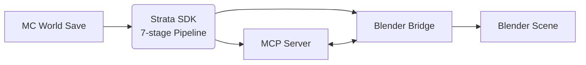
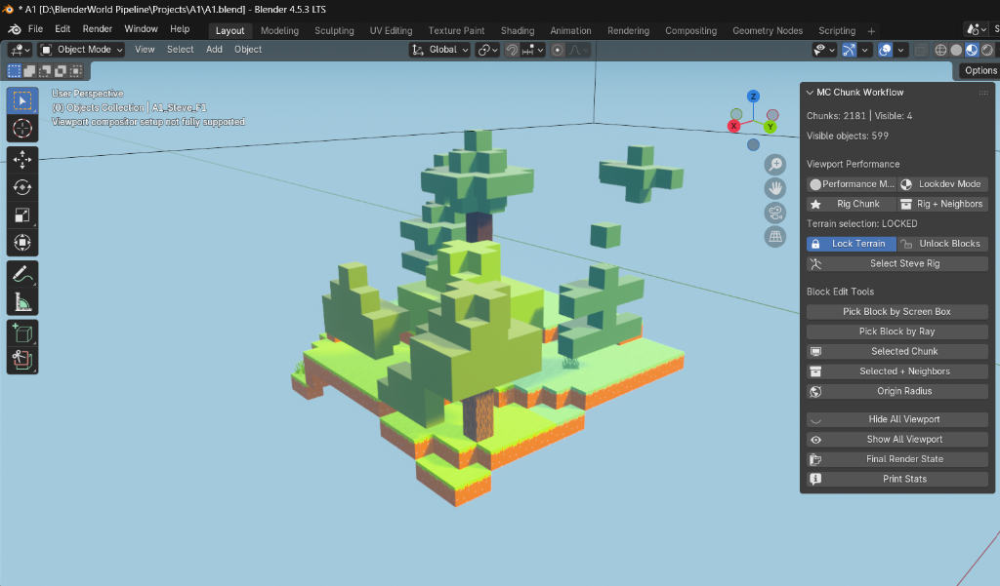
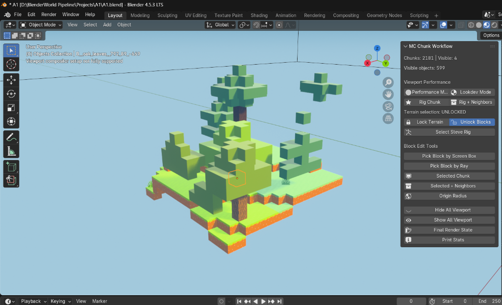
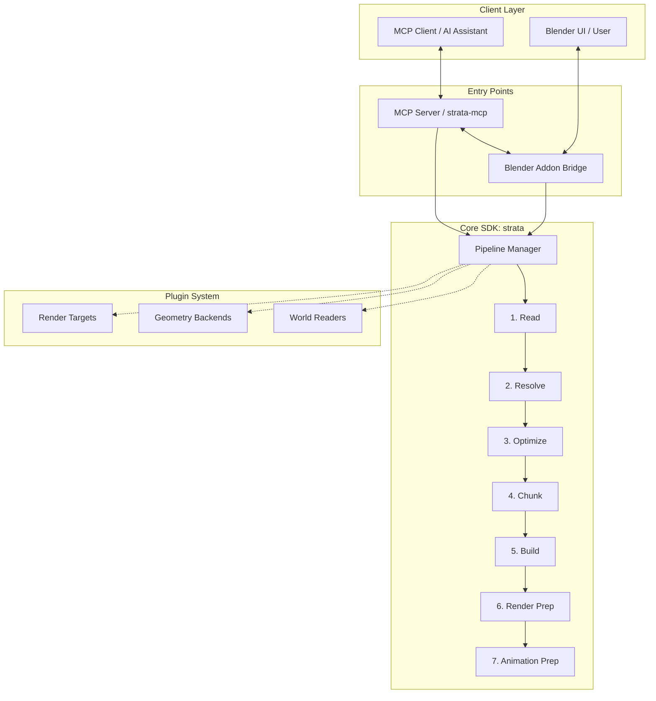

# Strata

**AI-native production pipeline for Blender.**

Strata is a professional, AI-native production pipeline designed specifically for Blender. It seamlessly translates massive, complex Minecraft worlds into optimized, render-ready cinematic scenes. By encapsulating deep production knowledge into a reusable software SDK, Strata eliminates repetitive scripts and prompts. The pipeline is fully integrated with a Model Context Protocol (MCP) server, allowing AI assistants to drive Blender directly, executing highly complex 3D workflows through natural language.

---

## Showcase

### Large World Import

Strata gracefully handles entire world regions by smartly chunking data for unparalleled viewport performance. You can load massive landscapes spanning thousands of blocks without bringing Blender to a halt.

### Responsive Viewport

The built-in MC Chunk Workflow addon lets you toggle chunk visibility on the fly, keeping the viewport fast and responsive. Your entire dense forest scene remains completely render-ready in the background while you focus on local details.

### Night Cinematic

Strata provides production-ready lighting right out of the box using real, optimized geometry. This enables the rapid creation of moody, cinematic shots, taking full advantage of Blender's powerful render engines.

### Sky and Atmosphere

Gain precise artistic control over each individual chunk and the broader environment. Strata allows you to stylize elements like clouds and sky, seamlessly blending voxel aesthetics with high-end atmospheric rendering.

### Character and Lighting

Achieve stunning character integration with cinematic lighting capabilities. Whether it's a dynamic torch light in a deep cave or complex volumetric effects, Strata ensures characters sit perfectly within the imported voxel environments.

### Addon Interface

The custom MC Chunk Workflow panel resides directly in Blender's 3D Viewport. It provides immediate access to performance toggles, chunk locking, and ray-casting selection tools. This interface bridges the gap between raw Python pipeline outputs and intuitive artist workflows.

---

## Why Strata Exists

In the world of 3D production, technical artists and creators often find themselves solving the same problems repeatedly. Every new project requires custom scripts to import data, optimize geometry, manage materials, and set up render passes. When working with AI, this problem compounds; we spend countless hours writing the same complex prompts to guide AI models through intricate Blender workflows, only for that knowledge to be lost when the chat session ends.

Strata was built to break this cycle. We believe that hard-won production knowledge—the specialized techniques required to efficiently turn raw voxel data into cinematic scenes—should become reusable, systematic software. 

Instead of relying on fragile, one-off scripts, Strata captures these workflows as a robust, pure Python SDK featuring a deterministic 7-stage pipeline. This architecture guarantees reliable results, transforming raw `.mca` region files into beautifully structured Blender scenes every single time. 

By building a proper plugin system, we ensure that Strata can adapt to various world readers, geometry backends, and render targets, extending its lifespan far beyond any single project. Furthermore, Strata acts as a crucial bridge between modern AI capabilities and professional 3D tools. Through its dedicated Model Context Protocol (MCP) server and socket-based Blender addon, AI assistants can now natively interact with your Blender session. They can query scene status, import worlds, and orchestrate complex pipeline operations on your behalf. 

Strata is not just an import tool; it is a permanent repository for 3D production intelligence, designed so that the creative community can build upon, share, and continually refine these advanced workflows.

---

## Features

### Current (v0.1)
- Parse real Minecraft Anvil saves (`.mca` region files)
- 7-stage deterministic pipeline (Read → Resolve → Optimize → Chunk → Build → Render Prep → Animation Prep)
- Chunk-based hidden-block culling (Stage 4) for massive geometry reduction
- Geometry Nodes instancing backend (supports thousands of chunks and millions of blocks)
- MC Chunk Workflow addon: toggle chunk visibility mid-session, lock chunks, show/hide all
- Socket bridge: MCP server ↔ Blender main thread (thread-safe queue via `bpy.app.timers`)
- 3 core MCP tools: `get_scene_status`, `list_block_library`, `import_minecraft_world`
- Plugin system for world readers, geometry backends, and render targets
- MIT license, easily pip-installable (`pip install -e .`)

### Planned
- Litematica schematic support (v0.2)
- Unreal Engine render target (v0.3)
- Animation timeline integration (v0.4)
- PyPI distribution for easier installation
- Web-based block map editor for rapid material assignments

---

## Architecture

The Strata architecture is designed with two distinct entry points, or "doors," that both leverage the same underlying logic. 

The first door is the **MCP Server (`strata-mcp`)**, designed for AI clients. It exposes pipeline capabilities as callable tools, allowing AI assistants to orchestrate scene creation. The second door is the **Blender Addon**, designed for human creators interacting directly with the Blender UI. 

Crucially, both doors feed directly into the unified **Strata SDK**. This core Python package manages the deterministic 7-stage pipeline. Because both interfaces use the exact same SDK, an AI can start a process via MCP, and a human can seamlessly continue editing the resulting scene in Blender, or vice versa. 

To make this bidirectional communication safe, Strata utilizes a socket-based **Bridge**. Since Blender's Python API is notoriously not thread-safe, the MCP server runs asynchronously and sends commands over a socket (port `:9877`). The Blender addon listens to this socket and safely executes incoming commands on Blender's main thread using a thread-safe queue managed by `bpy.app.timers`.

Finally, the SDK is highly extensible through its **Plugin System**. This abstraction allows developers to easily swap out major components: you can read from Anvil files or Litematica schematics, generate meshes via Geometry Nodes or barebones Python, and target rendering in EEVEE/Cycles or eventually Unreal Engine—all without altering the core pipeline logic.

---

## Quick Start

### For Creators
1. Download the latest `strata-addon.zip` release.
2. Open Blender 4.0+.
3. Navigate to `Edit` > `Preferences` > `Add-ons`.
4. Click `Install...`, select `strata-addon.zip`, and enable it.
5. In the 3D Viewport side panel (press `N`), locate the **Strata** tab.
6. Click **Start Bridge Server** to open the socket on port `:9877`.
7. Install the MCP server globally: `pip install strata-mcp`.
8. Configure your preferred AI assistant (e.g., Claude Desktop) to use the `strata-mcp` tool.
9. Ask your AI assistant to: "Import the Minecraft world located at `C:/path/to/saves/MyWorld`".
10. Watch as Strata builds the scene directly in your active Blender session!

### For Developers
1. Clone the repository: `git clone https://github.com/example/strata.git`
2. Navigate to the project root: `cd strata`
3. Create a virtual environment: `python -m venv venv`
4. Activate the virtual environment: `.\venv\Scripts\activate` (Windows) or `source venv/bin/activate` (Mac/Linux)
5. Install in editable mode with development dependencies: `pip install -e .[dev]`
6. Run the test suite to verify the installation: `pytest`
7. Explore the core pipeline logic in the `strata/` directory.
8. Check out `CONTRIBUTING.md` to learn how to write new plugins.

---

## Documentation

| Guide | Audience | Description |
|---|---|---|
| [Setup](docs/setup.md) | Everyone | Detailed installation instructions for all environments. |
| [Quick Start](docs/quick-start.md) | Creators | Get up and running with your first world import in minutes. |
| [Workflows](docs/workflows.md) | Creators | Advanced tutorials on lighting, rendering, and chunk management. |
| [Architecture](docs/architecture.md) | Developers | Deep dive into the SDK, Pipeline, Bridge, and Plugin systems. |
| [Roadmap](docs/roadmap.md) | Everyone | What we're building next and our long-term vision. |
| [Contributing](docs/contributing.md) | Developers | How to submit PRs, write plugins, and run tests. |
| [Vision](docs/vision.md) | Everyone | The philosophy behind AI-native production tools. |

---

## Contributing
We welcome contributions from everyone! Whether it's adding a new render target, fixing a bug, or improving documentation, your help is appreciated. Please see our [CONTRIBUTING.md](CONTRIBUTING.md) for details on how to get started, our code of conduct, and the pull request process.

## License
Strata is released under the [MIT License](LICENSE).
