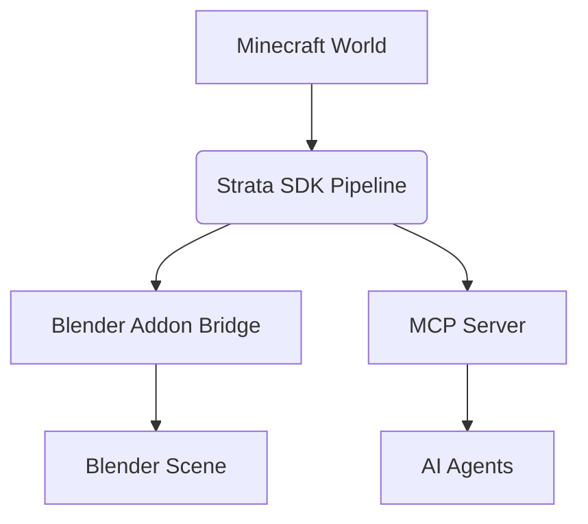

# Strata Architecture

## 1. Overview

Strata is built on a "Two doors, one pipeline" concept. 



## 2. The SDK (`strata/`)
The pure Python SDK contains the core logic.
- **`Pipeline`**: The orchestrator class.
- **`PipelineState`**: The data object passed between stages.
- Operates strictly outside of Blender's `bpy` context until the final target stage.

## 3. Plugin System
Strata uses a dynamic plugin system.
- **Discovery**: Uses entry-points to find installed plugins.
- **Interfaces**:
  - `WorldReader`: Reads voxel data (e.g., Anvil, Litematica).
  - `GeometryBackend`: Constructs mesh data (e.g., Geometry Nodes, Barebones).
  - `RenderTarget`: Formats for the final engine (e.g., EEVEE/Cycles, Unreal).

## 4. The 7 Pipeline Stages

| Stage # | Name | Module | What it does | Input | Output |
|---------|------|--------|--------------|-------|--------|
| 1 | Read World | `stage_read.py` | Parses save files | Path | Raw Voxel Data |
| 2 | Resolve Assets | `stage_resolve.py` | Maps voxel IDs to 3D assets | Voxel Data | Asset Mappings |
| 3 | Optimize | `stage_optimize.py` | Culls unseen faces, merges | Asset Mappings | Optimized Data |
| 4 | Chunk | `stage_chunk.py` | Groups data into spatial chunks| Optimized Data | Chunked Data |
| 5 | Build Geometry | `stage_geometry.py`| Constructs actual 3D meshes | Chunked Data | Mesh Data |
| 6 | Render Prep | `stage_render.py` | Assigns materials, shading | Mesh Data | Render-Ready Data |
| 7 | Animation Prep | `stage_anim.py` | Prepares rigs and timeline | Render Data | Final Scene Data |

## 5. Blender Bridge
The `bridge_server.py` runs a socket server on port `9877` inside Blender.
- **Thread-Safety**: Blender's API is not thread-safe. The bridge receives network requests and places them in a queue. `bpy.app.timers` periodically checks this queue on the main thread and safely executes the operations.

## 6. The Addon (`addon/`)
- **`bl_info`**: Standard Blender addon metadata.
- **`chunk_workflow`**: Subpackage for UI panels (toggling visibility, locking chunks, ray picking, snap to nearest chunk).
- **`world_import`**: UI for direct manual imports without MCP.

## 7. MCP Server (`server/`)
The `server.py` uses FastMCP to expose three tools:
- `get_scene_status`
- `list_block_library`
- `import_minecraft_world`
The server is "thin"—it contains no pipeline logic, merely delegating to the SDK and sending results over the bridge.

## 8. Extension Points

Adding a new Render Target:
```python
from strata.plugins import RenderTarget

class UnrealRenderTarget(RenderTarget):
    def process(self, state: PipelineState) -> PipelineState:
        # Export to USD
        return state
```

## 9. Testing Philosophy
- Pure Python testability: The SDK must run without Blender.
- No `import bpy` at the module level in the SDK.
- Stages must be deterministic for easy unit testing.

## 10. File Map
```text
strata/
├── addon/
│   ├── bridge_server.py
│   ├── chunk_workflow/
│   └── world_import/
├── strata/
│   ├── pipeline.py
│   └── stages/
├── server/
│   └── server.py
└── tests/
```
