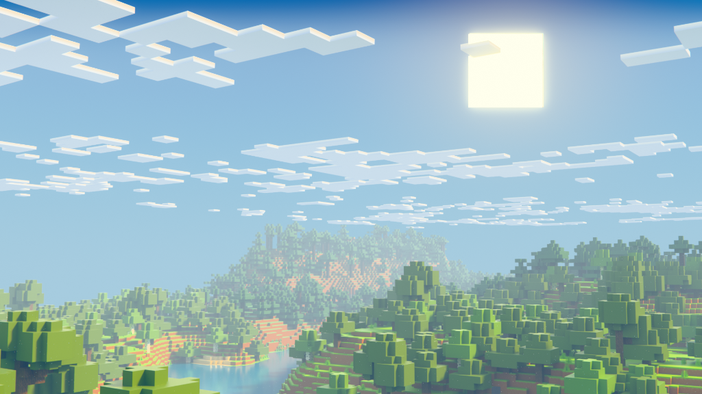

# Strata Quickstart

Goal: Import your first Minecraft world into Blender in under 10 minutes.

## Before you begin

Ensure you have the following ready:
- **Strata installed**: The SDK, Blender addon, and MCP server must be installed.
- **Blender 4.0+ installed**: Ensure you are running version 4.0 or higher.
- **Minecraft Java save**: A valid Minecraft Java edition world save folder.
- **Library `.blend`**: A Blender file containing block prototype objects.

## Step 1: Start Blender and Enable the Addon

1. Open Blender.
2. Go to the 3D Viewport.
3. Press `N` to open the N-panel on the right side.
4. Find and click on the **Strata** tab.

## Step 2: Start the Bridge

In the Strata tab in Blender, click the **Start Strata Bridge** button. 

**What this does:** It starts a local server on port `9877` within Blender. This connects the external Strata pipeline and MCP server to Blender, allowing commands to be executed safely via Blender's thread-safe queue (`bpy.app.timers`).

## Step 3: Start the MCP Server

Open a terminal or command prompt and run the following command:

```bash
strata-mcp
```

**What happens next:** You should see output indicating that the FastMCP server has started and is listening for connections. It is now ready to receive commands from an AI agent or direct MCP client.

## Step 4: Import your World

Using your MCP client (or an AI agent connected to the MCP server), call the `import_minecraft_world` tool. 

Example tool call:
```json
{
  "world_path": "C:/path/to/your/world/save",
  "library_blend_path": "C:/path/to/block_library.blend",
  "center_x": 0,
  "center_z": 0,
  "radius": 5
}
```

**Parameters:**
- `world_path`: The absolute path to your Minecraft world save directory.
- `library_blend_path`: The path to the `.blend` file containing your block models.
- `center_x`: The X coordinate (in chunks) for the center of the import area.
- `center_z`: The Z coordinate (in chunks) for the center of the import area.
- `radius`: The radius (in chunks) around the center to import.

## Step 5: Explore the Chunk System

Once the import finishes, check Blender:
- You will see your Minecraft chunks imported as separate objects.
- Use the **MC Chunk Workflow** panel in the Strata tab to:
  - **Toggle chunk visibility**: Hide/show specific chunks to improve viewport performance.
  - **Lock chunks**: Prevent accidental edits.
  - **Pick by ray/box**: Select chunks using raycasting or box selection.
  - **Snap to nearest chunk**: Quickly snap your 3D cursor or view to the closest chunk.

## Step 6: Render

Set up your lighting, cameras, and materials as usual. 
*Note: All imported chunks are marked as render-visible by default, even if you toggle them off in the viewport to save memory. They will all show up in the final render!*

## Expected Result

You should now see a fully optimized, production-ready section of your Minecraft world in Blender!



## Common Mistakes

1. **Wrong world path:** Ensure you are pointing to the root of a valid Minecraft Java save folder.
2. **No library `.blend`:** The pipeline needs a block library to resolve block geometry.
3. **Bridge not running:** If the bridge isn't started in Blender, the MCP server cannot send the scene data.
4. **Chunks too large:** Trying to import a massive radius on your first try might freeze your system. Start small!
5. **Block map missing:** If some blocks appear as missing or empty, ensure your block mappings are correctly configured for your library.
