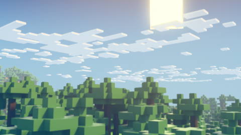
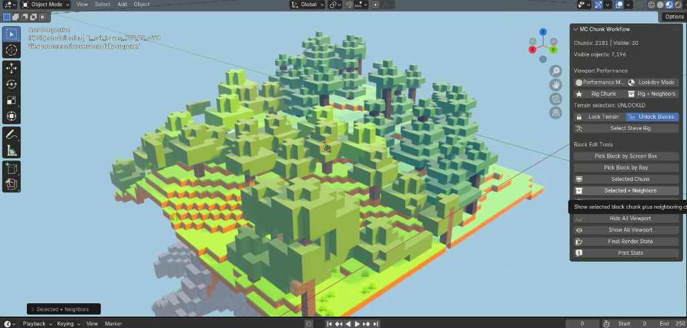
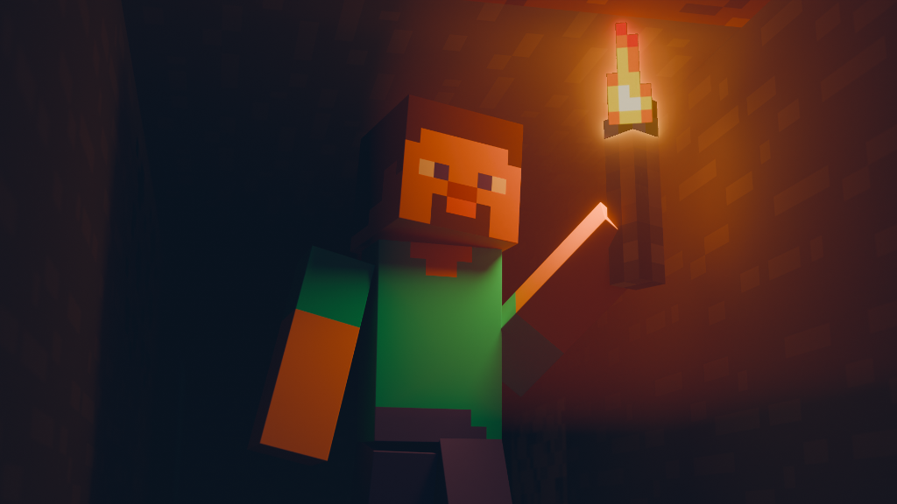

# Strata Workflows

This document outlines complete production workflows using the Strata pipeline. For installation instructions, please see [SETUP.md](file:///C:/Users/LENONO/.gemini/antigravity/scratch/mc-chunk-workflow/docs/SETUP.md).

## 1. Minecraft Cinematic

**Purpose:** Create high-quality renders or animations of a Minecraft build.
**Prerequisites:** Strata installed, a detailed Minecraft save, a finalized block library.
**Inputs:** World path, library `.blend`.

**Steps:**
1. Start the Strata Bridge in Blender.
2. Run `strata-mcp` in your terminal.
3. Import the specific region of interest using the `import_minecraft_world` MCP tool.
4. Use the MC Chunk Workflow addon to hide distant chunks in the viewport, keeping viewport FPS high.
5. Add lighting (e.g., sun lamp, HDRI sky).
6. Set up your camera and camera animations.
7. Render using Cycles (or EEVEE).

**Common Mistakes:** Forgetting that hidden chunks in the viewport will still render. Use render visibility toggles if you actually want to exclude chunks from the final image.
**Expected Result:** A clean, optimized scene ready for final rendering.

## 2. Large World Management

**Purpose:** Import and manage massive regions (>1000 chunks) without crashing Blender.
**Prerequisites:** High RAM system.
**Inputs:** Large radius in the import command.

**Steps:**
1. Perform the import in batches if necessary, or use a large radius.
2. Immediately use the **Chunk Workflow** panel to lock all terrain.
3. Toggle viewport visibility off for all chunks outside your immediate working area.
4. Use the "Snap to Nearest Chunk" feature to quickly navigate the massive scene.

**Common Mistakes:** Leaving all chunks visible in the viewport, causing Blender to hang.
**Expected Result:** A massive world successfully loaded into Blender, manageable through the chunk workflow tools.

## 3. Chunk Workflow Day-to-Day

**Purpose:** Efficiently navigate and edit within a loaded Strata scene.
**Prerequisites:** A world already imported into Blender.
**Inputs:** None (uses existing scene).

**Steps:**
1. **Mid-session toggling:** As you move the camera, use the addon panel to disable chunks behind you and enable chunks ahead.
2. **Picking nearest chunk:** Use the ray/box selection tools in the N-panel to select specific chunks for editing.
3. **Locking terrain:** Lock finished chunks to avoid accidentally moving them while placing props or characters.

**Common Mistakes:** Accidentally moving a chunk object, breaking the grid alignment. Always lock chunks unless explicitly editing them.
**Expected Result:** A smooth, responsive editing experience even in dense scenes.

## 4. Block Map Workflow

**Purpose:** Create and refine a `block_map.json` to resolve unknown or custom blocks.
**Prerequisites:** A library `.blend` with custom block models.
**Inputs:** Missing block identifiers from console.

**Steps:**
1. Attempt an initial import. Note any missing blocks in the console warnings.
2. Create or edit `block_map.json`.
3. Map the Minecraft block IDs (e.g., `minecraft:custom_stone`) to the exact object names in your library `.blend` (e.g., `CustomStone`).
4. Re-run the import or the Resolve Assets stage.
5. Verify all blocks are correctly instantiated.

**Common Mistakes:** Typographical errors in the block IDs or object names. They must match exactly.
**Expected Result:** Every block from the Minecraft save correctly maps to its 3D prototype.

## 5. Agent-Assisted Workflow

**Purpose:** Use an AI agent (like Claude) with the MCP server to automate the import and setup process.
**Prerequisites:** MCP server running, an MCP-compatible AI client.
**Inputs:** Natural language prompts.

**Steps:**
1. Connect your AI agent to the `strata-mcp` server.
2. Ask the agent: "Check the scene status." (Agent uses `get_scene_status`).
3. Ask the agent: "List available blocks in my library." (Agent uses `list_block_library`).
4. Ask the agent: "Import my survival world centered at 0,0 with a radius of 10." (Agent uses `import_minecraft_world`).

**Common Mistakes:** Not starting the Blender Bridge first, which causes the agent's import command to fail when it tries to send data to Blender.
**Expected Result:** A hands-free import process driven entirely by natural language commands.
